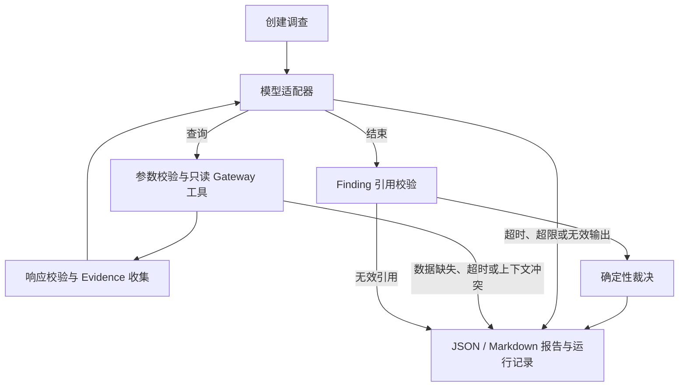

# Agent

主要负责人：[@Manticore0918](https://github.com/Manticore0918)

ReleaseGuard 是一个面向渐进式发布的 AI 辅助可靠性平台。Agent 负责调查、推理、
建议与评测；Ops Gateway（平台侧）负责基础设施访问、权限、执行、幂等与审计。
**Agent 不直接访问 Kubernetes 或执行任意命令**，只能通过 `../contracts/openapi.yaml`
定义的版本化契约读取数据。

> 原有 `releaseguard-smoke` 入口交付 **Agent Developer Preview**。它提供一份可复现的
> **Agent 契约冒烟测试**——在没有真实基础设施、没有 LLM、没有 LangGraph 的前提下，
> 读取共享契约 fixture，完成一次确定性 mock 调查，并输出区分事实/推断/建议的报告。
> Developer Preview 只作为开发基础，不单独构成正式作品集版本；v0.1 必须通过独立 HTTP Mock Gateway 与平台侧形成联合闭环。

## LangGraph 最小调查 harness

新增 `releaseguard-investigate` 入口，以 LangGraph `StateGraph` 运行只读调查。
已有 Pydantic 契约、Evidence/Finding 模型、证据转换、确定性裁决和报告渲染继续复用，
原有 smoke CLI 与测试保持兼容。

当前交付范围：独立的 `GatewayClient` 接口、fixture 数据源替身、可替换的
`ModelAdapter`、确定性模型替身、受限工具循环、上下文与证据校验，以及统一报告出口。
当前没有 HTTP Gateway 实现、真实 LLM、审批、回滚执行或恢复验证，尚未达到 Portfolio v0.1 验收要求。



### 安装与运行

在仓库根目录下使用 PowerShell：

```powershell
cd agent
python -m venv .venv
.venv/Scripts/python.exe -m pip install -e ".[test]"
.venv/Scripts/releaseguard-investigate.exe
.venv/Scripts/python.exe -m pytest
```

在 bash 中，安装命令对应 `.venv/bin/python -m pip install -e ".[test]"`，
运行入口为 `.venv/bin/releaseguard-investigate`，测试为 `.venv/bin/python -m pytest`。

默认示例应输出 `处置=HOLD`、`模型调用=3 工具调用=2 错误=无`。
它只读取 deployment 与 metrics 两份 fixture，不加载 rollback 请求中的审批信息。
可通过 `--fixtures-dir`、`--output-dir`、`--service` 和 `--environment` 指定输入与输出；
选择的服务和环境必须与 fixture 原始标签一致，替身不会擅自重写标签。

报告默认保存在 `reports/local/agent/harness/`：

- `incident-<调查ID>.json`：复用现有 IncidentReport 结构。
- `incident-<调查ID>.md`：事实、推断、缺失证据和建议。
- `run-<调查ID>.json`：报告、按顺序记录的节点与工具结果、调用次数和错误码。

CLI 每次生成独立调查 ID。正常结束（包括证据不足的 `INCONCLUSIVE`）返回 0；
数据源故障、参数/证据校验失败、超时或超限返回 1，并尽可能保存失败报告。
库调用提供相同 `InvestigationRequest` 和固定数据时，结果可重复。

### 数据与运行边界

- `GatewayClient` 只包含 `get_deployment` 与 `compare_metrics` 两个异步方法。
  后续 HTTP client 实现同一接口，图节点无需了解 fixture 路径。
- `ModelAdapter.next_turn()` 接收独立快照，返回一次工具请求或最终 Finding；
  模型不能直接修改图状态，也不能决定服务、环境或指标版本。
- 默认最多 4 次模型调用、3 次工具调用，每次异步调用超时 10 秒；可通过
  `RunLimits` 调整。适配器必须使用支持取消的异步 I/O，不能阻塞事件循环。
- Finding 的引用必须存在、唯一、属于当前服务与版本，并包含部署和可比较的回归指标；
  无效引用会生成 `INCONCLUSIVE`，不会进入处置。
- 该版本只对延迟和错误率使用既有“高于 baseline 的 1.2 倍、样本量至少 100”规则。
  request rate 和 availability 保留为事实，待双方约定指标方向与阈值后再参与判断。
- fixture 时间仅用于离线重放；尚未实现按实际时钟判断证据新鲜度、完整时间窗校验、
  SQL 级根因校验和进程崩溃后的 checkpoint 恢复。运行记录在调查结束时写盘。
- 当前证据仅有部署与指标，结论最多为 `HOLD`，不会生成写动作。
  `full` 模型与 HTTP Gateway 的实现将在后续 PR 中接入相同运行路径。

### 代码入口

| 文件 | 职责 |
|---|---|
| `src/releaseguard/harness.py` | 调查图、工具边界、校验、裁决与 CLI |
| `src/releaseguard/harness_models.py` | 运行请求、模型协议、预算、确定性替身与轨迹模型 |
| `src/releaseguard/gateway.py` | 只读客户端接口与 fixture 替身 |
| `tests/test_harness.py` | 实际图运行、预算、超时、越界调用、无效证据和状态隔离测试 |

参考：[LangGraph Graph API](https://docs.langchain.com/oss/python/langgraph/graph-api)。

## 原有 smoke 入口能做什么

在任意干净环境执行一条命令（见下），即可：

1. **校验共享契约 fixture**：加载并校验 `contracts/examples/*.json`
   （deployment / metrics compare / rollback request）符合 OpenAPI v0.1 的结构与语义；
2. **跑一次确定性 mock 调查**：把 fixture 转成结构化 `Evidence`，
   按固定规则判断回归、形成 `Finding`，并裁决处置方向；
3. **生成事故报告**：机器可读 JSON + 人可读 Markdown，严格区分事实 / 推断 / 建议；
4. **输出冒烟验收证据**：stdout 打印 PASS / 判定结果，可作为 Developer Preview 验收证据留档。

## 原有 smoke 快速开始

要求：Python 3.11+。

```bash
# 在仓库根目录下执行（fixture 位于 contracts/examples，会被自动发现）
cd agent

# 方式 A：无需安装，直接以 src 作为模块路径运行
PYTHONPATH=src python -m releaseguard.smoke        # bash / macOS / Linux
# PowerShell：$env:PYTHONPATH="src"; python -m releaseguard.smoke

# 方式 B：安装为可执行命令后运行（跨平台一致）
python -m venv .venv
# Windows：.venv\Scripts\activate    /    macOS-Linux：source .venv/bin/activate
pip install -e ".[test]"
releaseguard-smoke
```

保存验收证据（stdout 即“Agent 契约冒烟测试输出”）：

```bash
PYTHONPATH=src python -m releaseguard.smoke > reports/local/agent-smoke-output.txt
```

运行契约冒烟测试（pytest）：

```bash
cd agent
PYTHONPATH=src python -m pytest            # 或 pip install -e ".[test]" 后直接 pytest
```

> 提示：Windows 控制台若出现中文乱码，可在命令前加 `PYTHONIOENCODING=utf-8`。

生成的 JSON / Markdown 报告默认写入 `<仓库根>/reports/local/agent/`（已被
`.gitignore` 忽略，不会污染仓库）。可用 `--output-dir` 修改输出位置，用
`RELEASEGUARD_FIXTURES_DIR` 环境变量覆盖 fixture 目录（便于 CI 接入平台方 mock）。

> 在仓库外配合 `--fixtures-dir` / `RELEASEGUARD_FIXTURES_DIR` 直接使用平台方 mock
> 目录时，默认输出目录无法定位（位于仓库内），请同时用 `--output-dir` 指定输出位置。

## 原有 smoke 代码结构

```text
agent/
├── pyproject.toml                  # Pydantic + LangGraph；test extra 提供 pytest
├── src/releaseguard/
│   ├── contracts.py                # OpenAPI v0.1 报文模型 + fixture 加载/校验
│   ├── domain.py                   # Investigation/Evidence/Finding/Proposal/Report 领域模型
│   ├── smoke.py                    # 确定性 mock 调查流水线 + CLI（releaseguard-smoke）
│   └── report.py                   # JSON + Markdown 报告渲染
└── tests/
    ├── test_contract_fixtures.py   # 共享 fixture 契约符合性测试
    └── test_smoke_investigation.py # 调查流水线：正常/降级/裁决/报告输出
```

## 冒烟测试判定逻辑

`smoke.decide()` 使用确定性规则（不由 LLM 自评，符合项目“AI 提议，策略裁决”原则）：

| 条件 | 处置 | 是否触发执行动作 |
|---|---|---|
| 缺部署或指标数据 / 不可比 / 未检测到回归 | `INCONCLUSIVE` | 否 |
| 确认 candidate 回归，但缺代码变更（git）证据 | `HOLD` | 否（保守） |
| 部署 + 指标 + 变更证据齐备，置信度达标 | `ROLLBACK_RELEASE` | 构造建议，**需人工审批**，不自动执行 |

- 所有结论只引用真实存在、确实落入本次调查的 `evidence_id`；
- 缺失的日志 / 链路 / 代码变更证据会写入 `finding.missing_evidence`，
  **绝不把“无数据”当作正常，也绝不编造“已定位到具体 SQL”**；
- 主流程对当前共享 fixture 的判定为 `HOLD`；`ROLLBACK_RELEASE` 路径由单元测试
  构造完整证据（deployment+metrics+git）覆盖，并验证其符合写契约 `RollbackRequest` 形状。

## Developer Preview 退出条件对照

- [x] Agent 能根据 fixture 生成一次模拟调查结果（`releaseguard-smoke`）；
- [x] Agent 契约冒烟测试输出可复现（确定性、无随机、无网络）；
- [x] 仓库无 secret / token / kubeconfig；
- [ ] 与平台侧共同 review OpenAPI v0.1，并让平台侧的契约冒烟测试并行通过；
- [ ] 双方各一个合并 PR（本目录通过 PR 合入 `main`）。

详细版本路线见 [`../docs/PROJECT_DIRECTION_AND_CHECKPOINTS.md`](../docs/PROJECT_DIRECTION_AND_CHECKPOINTS.md)
与 [`../docs/AGENT_ENGINEER_PLAYBOOK.md`](../docs/AGENT_ENGINEER_PLAYBOOK.md)。
