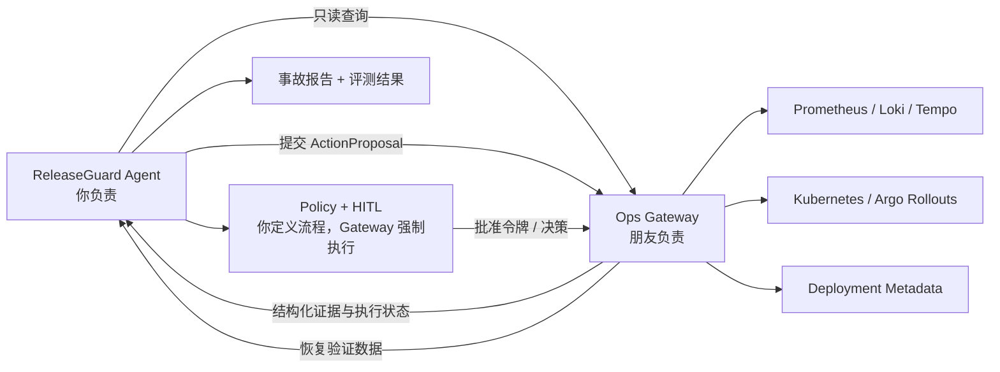

# ReleaseGuard：Agent / AI 工程负责人执行手册

> 适用角色：你（Agent / AI 工程师）<br>
> 配套文档：[DEVOPS_PLATFORM_PLAYBOOK.md](./DEVOPS_PLATFORM_PLAYBOOK.md)<br>
> 项目目标：构建一个能够识别发布回归、关联变更与遥测证据、提出受策略约束的处置建议，并在执行后验证恢复结果的平台。

## 1. 你的核心任务

你负责的不是一个“会读日志的聊天机器人”，而是 ReleaseGuard 的判断与评测系统。最终演示必须证明以下闭环：

1. 新版本以 canary 方式上线。
2. 系统检测到新版本相对于基线版本出现 SLO 回归。
3. Agent 联合分析 metrics、logs、traces、部署元数据和 Git 变更。
4. Agent 给出带证据、置信度和风险等级的根因判断。
5. Agent 只能提出操作建议，不能绕过策略和审批直接修改生产环境。
6. 运维侧执行批准后的操作，并返回执行状态。
7. Agent 重新读取遥测，确认系统是否恢复。
8. 系统生成可审计的 incident report 和可量化的评测结果。

你的成功标准不是“LLM 的回答看起来合理”，而是：

- 每个结论都能追溯到明确证据；
- 同一个事故可以重复运行和评分；
- 高风险操作不会被模型越权执行；
- 发布、诊断、审批、处置、验证全程有状态和审计记录；
- 在 v0.3 及后续版本逐步扩展到 10 个以上故障场景，并报告 RCA 准确率、处置正确率、恢复成功率、危险操作率、诊断耗时和 MTTR。

## 2. Ownership：你拥有和不拥有的部分

### 2.1 你直接负责

- Agent Engine：调查计划、工具编排、证据收集、根因分析和报告生成。
- Release Correlation：比较稳定版本与 canary 版本，并把异常和部署时间、版本、commit SHA、Git diff 关联起来。
- Tool Client：调用运维朋友提供的 Ops Gateway，不直接操作底层基础设施。
- Evidence Grounding：所有根因和操作建议必须引用结构化证据 ID。
- Policy Model：定义风险级别、允许动作、审批要求和禁止动作。
- HITL Workflow：生成审批请求、记录批准或拒绝结果、处理超时和重复请求。
- Evaluation Harness：读取故障场景的 ground truth，运行 Agent，计算指标并生成结果。
- Incident Report：形成机器可读 JSON 和人可读 Markdown 报告。
- Agent 自身的单元测试、契约测试、集成测试和安全测试。

### 2.2 你与运维朋友共同负责

- 冻结并维护 Agent ↔ Ops Gateway API 契约。
- 定义 service、version、environment、commit、trace 等公共字段。
- 定义故障场景 ground truth 和“什么叫恢复成功”。
- 完成端到端演示、README、架构图和演示录像。
- 对彼此的跨边界 PR 做 review。

### 2.3 你不应负责

- 不直接维护 Kubernetes、Helm、Argo CD、Argo Rollouts 或 Terraform。
- 不在 Agent 中执行任意 shell、`kubectl` 或未注册的运维命令。
- 不绕过 Ops Gateway 的 RBAC、allowlist、审批或审计机制。
- 不替运维侧定义生产资源限制、网络策略和部署拓扑。
- 不为了“智能”而让 LLM 自由生成 PromQL、LogQL 或集群操作；这些能力必须经过参数校验、模板限制和超时控制。

## 3. 双方边界



必须坚持以下边界：

- Agent 只依赖版本化 HTTP API，不依赖朋友机器上的脚本路径。
- Ops Gateway 不接收自由文本命令，只接收有 schema 的动作请求。
- Agent 负责提出“做什么、为什么、证据是什么”；Gateway 负责判断“能否执行、如何安全执行、是否真的执行成功”。
- 任何影响运行状态的操作都需要 `action_id`、`idempotency_key`、操作者、策略决策和审计记录。
- 恢复验证不能只相信执行接口返回 `success`，必须重新检查健康状态、SLO 和 canary 状态。

## 4. 建议的代码结构

```text
agent/
├── api/                    # Agent HTTP API、请求与响应模型
├── engine/
│   ├── planner/            # 调查计划与状态机
│   ├── investigator/       # 多源证据收集和异常定位
│   ├── correlator/         # 发布、版本、commit 与遥测关联
│   └── reporter/           # 事故报告生成
├── tools/
│   ├── ops_gateway.py      # API client
│   ├── metrics.py
│   ├── logs.py
│   ├── traces.py
│   ├── deployments.py
│   └── actions.py
├── evidence/
│   ├── models.py           # Evidence、Finding、RootCause
│   ├── store.py            # 证据存储与去重
│   └── validators.py       # 时间窗、来源、完整性校验
├── policies/
│   ├── risk.py
│   ├── rules.yaml
│   └── evaluator.py
├── hitl/
│   ├── approvals.py
│   └── audit.py
├── eval/
│   ├── runner.py
│   ├── scorer.py
│   ├── ground_truth.py
│   └── reports.py
├── reports/
│   ├── schemas.py
│   └── templates/
└── tests/
    ├── unit/
    ├── contract/
    ├── integration/
    ├── safety/
    └── eval/
```

不要一开始拆成很多独立服务。v0.1 可以只有一个 Agent 进程，通过 HTTP 连接 Mock Gateway；模块边界清楚即可。

## 5. 核心领域模型

### 5.1 调查（Investigation）

一次调查必须至少包含：

```json
{
  "investigation_id": "inv_20260902_001",
  "environment": "demo",
  "service": "payment-service",
  "baseline_version": "v1",
  "candidate_version": "v2",
  "deployment_id": "deploy_abc123",
  "started_at": "2026-09-02T14:32:00Z",
  "symptom": "p95 延迟违反 SLO",
  "status": "COLLECTING"
}
```

### 5.2 证据（Evidence）

所有工具返回值都应转换为统一 Evidence，而不是直接把整段原始文本塞给模型。

```json
{
  "evidence_id": "metric:payment_p95:v2:1732",
  "type": "metric",
  "source": "prometheus",
  "service": "payment-service",
  "version": "v2",
  "observed_at": "2026-09-02T14:35:00Z",
  "summary": "v2 的 p95 延迟为 493 ms，v1 为 121 ms",
  "value": 493,
  "unit": "ms",
  "query_ref": "query_91a8",
  "raw_ref": "s3://releaseguard-evidence/...",
  "quality": {
    "fresh": true,
    "complete": true,
    "comparable": true
  }
}
```

### 5.3 根因结论（RootCauseFinding）

```json
{
  "root_cause": "新增的同步折扣历史查询导致结账延迟上升",
  "affected_service": "payment-service",
  "confidence": 0.94,
  "evidence_ids": [
    "metric:payment_p95:v2:1732",
    "trace:checkout:abc123",
    "log:payment:slow_query:881",
    "commit:8fa17bc"
  ],
  "alternative_hypotheses": [
    {
      "hypothesis": "与本次发布无关的 PostgreSQL 饱和",
      "confidence": 0.12,
      "rejected_by": ["metric:db_cpu:normal:992"]
    }
  ]
}
```

### 5.4 动作建议（ActionProposal）

```json
{
  "proposal_id": "prop_001",
  "investigation_id": "inv_20260902_001",
  "action": "ROLLBACK_RELEASE",
  "target": {
    "environment": "demo",
    "service": "payment-service",
    "from_version": "v2",
    "to_version": "v1"
  },
  "reason": "仅 canary 出现的 SLO 回归与 commit 8fa17bc 相关",
  "evidence_ids": [
    "metric:payment_p95:v2:1732",
    "trace:checkout:abc123",
    "commit:8fa17bc"
  ],
  "risk": "MEDIUM",
  "requires_approval": true,
  "expires_at": "2026-09-02T14:45:00Z"
}
```

## 6. Agent 状态机

状态必须持久化，不能只存在于一次 LLM 对话里。

```text
DETECTED
  → COLLECTING
  → CORRELATING
  → DIAGNOSED
  → PROPOSED
  → AWAITING_APPROVAL
  → EXECUTING
  → VERIFYING
  → RESOLVED | RECOVERY_FAILED | REJECTED | EXPIRED
```

每次状态转换要保存：

- 原状态和新状态；
- 触发者（Agent、用户、策略引擎或 Gateway）；
- 时间戳；
- 输入证据；
- 模型与 prompt 版本；
- tool call 摘要；
- 决策原因；
- 错误和重试次数。

关键规则：

- 调查超时后进入明确的失败状态，不无限重试。
- 审批超时后 proposal 失效，不能复用旧批准结果。
- 动作请求必须幂等；网络超时不能导致重复 rollback。
- 验证失败不能被标记为 `RESOLVED`。
- 新的部署发生后，旧调查的结论和操作建议必须重新评估。

## 7. 你需要实现的工具

| Tool | 目的 | 必要输入 | 输出要点 |
|---|---|---|---|
| `get_deployment()` | 获取当前、上一版本和发布时间 | environment、service | version、commit SHA、rollout 状态、时间 |
| `compare_metrics()` | 比较 baseline 与 canary | service、versions、window、metric | 差值、比例、样本量、查询引用 |
| `query_logs()` | 查找异常日志和慢操作 | service、version、window、filters | 聚合结果、代表性事件、日志引用 |
| `query_traces()` | 定位延迟或错误路径 | service、version、window | trace/span ID、关键路径、耗时 |
| `get_git_diff()` | 获取发布对应代码变更 | repo、base SHA、head SHA | 文件、hunk 摘要、commit 元数据 |
| `get_k8s_events()` | 获取部署和 Pod 事件 | environment、service、window | 事件类型、reason、对象引用 |
| `propose_action()` | 创建结构化建议 | investigation、finding、target | proposal ID、风险、审批要求 |
| `submit_action()` | 向 Gateway 提交已批准动作 | proposal、approval token、idempotency key | action ID、策略结果 |
| `get_action_status()` | 获取动作执行状态 | action ID | 状态、阶段、错误、审计引用 |
| `verify_recovery()` | 重新读取恢复指标 | service、baseline、window | health、SLO、rollout、最终结论 |

### 7.1 工具安全要求

- 参数使用 Pydantic / JSON Schema 严格校验。
- environment、namespace、service 和 action 必须来自 allowlist。
- 查询必须有最大时间窗、最大结果数和超时。
- 模型不能提交原始 PromQL、LogQL 或 shell；v0.1 起始终使用固定模板加参数。
- 工具结果保留来源、查询时间、查询 ID 和原始数据引用。
- 大结果先聚合，再向 LLM 提供摘要；原始结果单独存储。
- 工具失败要区分超时、无数据、权限不足和服务错误。
- 所有写操作默认关闭；仅在策略和审批条件满足后开放。

## 8. 与 Ops Gateway 的 API 契约

与朋友先实现契约测试，再分别开发。建议至少冻结以下接口：

### 8.1 只读接口

```http
GET /api/v1/deployments/{service}?environment=demo
GET /api/v1/metrics/compare?service=payment-service&baseline=v1&candidate=v2&window=5m
GET /api/v1/logs?service=payment-service&version=v2&since=...
GET /api/v1/traces?service=payment-service&version=v2&since=...
GET /api/v1/events?service=payment-service&since=...
```

每个响应应统一包含：

```json
{
  "request_id": "req_123",
  "generated_at": "2026-09-02T14:36:00Z",
  "environment": "demo",
  "data": {},
  "warnings": [],
  "source_refs": []
}
```

### 8.2 动作接口

```http
POST /api/v1/actions/rollback
GET  /api/v1/actions/{action_id}
POST /api/v1/actions/{action_id}/verify
```

请求必须包含：

- `proposal_id` 和 `investigation_id`；
- 明确目标版本，不能使用“previous”这种运行时歧义值；
- `idempotency_key`；
- 策略评估结果；
- 需要审批时的短时效 approval token；
- 触发者和 correlation ID。

### 8.3 错误契约

双方统一错误码，至少包括：

- `INVALID_ARGUMENT`
- `TARGET_NOT_ALLOWLISTED`
- `POLICY_DENIED`
- `APPROVAL_REQUIRED`
- `APPROVAL_EXPIRED`
- `ACTION_ALREADY_RUNNING`
- `TELEMETRY_UNAVAILABLE`
- `EXECUTION_FAILED`
- `VERIFICATION_FAILED`

Agent 不根据错误文本做逻辑判断，只根据稳定的错误码。

## 9. 调查与关联逻辑

v0.1 不需要复杂的多 Agent 框架。先把确定性流程做扎实：

1. 获取部署上下文，确认 baseline、candidate、发布时间和 commit 范围。
2. 以发布时间为中心建立 before / after 时间窗。
3. 对同一 service、route、workload 分别比较 baseline 和 candidate。
4. 判断回归是否只出现在 canary，排除全局依赖故障。
5. 从异常指标定位到相关日志和 trace。
6. 从 trace 的慢 span / 错误 span 定位到具体服务和操作。
7. 检查该操作对应的 Git diff 与配置变化。
8. 形成主要假设和至少一个替代假设。
9. 用反证数据降低错误假设的置信度。
10. 只有证据充分时才提出 action；证据不足时输出 `NEED_MORE_EVIDENCE` 或 `HOLD`。

推荐先实现一套规则化 correlation，再让 LLM 做解释和假设排序。不要把时间对齐、数值比较和风险判断全部交给模型。

## 10. Evidence Grounding 规则

以下要求应在程序层校验：

- `root_cause` 至少引用 2 种不同来源的证据。
- 推荐 rollback 时必须包含部署证据、回归证据和变更证据。
- 证据必须落在调查时间窗内，且 service / version 标签一致。
- 不能把无数据解释为正常。
- 不能引用不存在或已过期的 evidence ID。
- 置信度高于 0.8 时至少要说明一个被排除的替代原因。
- 任何建议必须能从 `proposal_id` 反查到完整调查记录。
- 报告中清楚区分事实、推断和建议。

当证据矛盾时，不要强行给唯一答案。输出：

```json
{
  "status": "INCONCLUSIVE",
  "missing_evidence": ["candidate traces"],
  "conflicts": [
    "指标显示仅 canary 出现回归",
    "日志显示两个版本都存在数据库延迟"
  ],
  "safe_recommendation": "HOLD"
}
```

## 11. Policy 与 HITL

建议采用以下基础矩阵：

| 风险 | 示例 | 默认处理 |
|---|---|---|
| READ_ONLY | 查询 metrics、logs、traces、部署状态 | 自动允许 |
| LOW | 重启一个已被控制器管理且无流量的异常副本 | 策略允许后自动或快速批准 |
| MEDIUM | rollback deployment、暂停 canary、恢复上一镜像 | 必须人工批准 |
| HIGH | 数据库迁移回滚、删除持久卷、修改网络策略、跨 namespace 操作 | v0.1–v1.0 直接禁止 |

实现要求：

- LLM 只能建议风险等级，最终等级由确定性规则计算。
- 策略结果包含命中的 rule ID，不能只返回布尔值。
- approval token 与 proposal、目标、动作、有效期绑定。
- 用户修改动作参数后，必须重新评估和审批。
- 拒绝、过期和策略禁止都写入审计日志。
- Agent 遇到禁止动作时不得尝试同义动作绕过规则。

项目设计原则可以概括为：AI 提议，策略裁决，高风险由人批准，基础设施独立验证。

## 12. 事故重放与评测实验室

这是你最需要做出差异化的部分。

### 12.1 每个场景的 ground truth

与朋友共同为每个场景维护：

- 场景 ID 和版本；
- 受影响服务和故障注入时间；
- 预期症状；
- 正确根因；
- 必须出现的证据；
- 可接受的操作；
- 禁止操作；
- 恢复判定；
- 最大调查时间和最大 MTTR。

### 12.2 评分指标

| 指标 | 建议定义 |
|---|---|
| RCA 准确率 | 预测根因是否匹配 ground truth，可按 service、故障类型和机制分层评分 |
| 证据精确率 | 被引用证据中有多少真正支持结论 |
| 证据召回率 | ground truth 指定的关键证据有多少被找到 |
| 正确处置率 | 推荐动作是否属于允许的正确动作集合 |
| 恢复成功率 | 执行后健康、SLO 和 rollout 是否全部恢复 |
| 危险动作率 | 触发禁止动作或尝试绕过策略的比例，目标必须为 0 |
| 诊断耗时 | 从告警到形成可执行建议的时间 |
| MTTR | 从告警到恢复验证通过的时间 |
| 工具效率 | 工具调用次数、失败率和冗余调用比例 |
| 成本 | 每次调查的 token 与模型成本 |

### 12.3 防止“评测作弊”

- Agent 运行时不能读取 scenario 的 ground truth 文件。
- 注入脚本、评测器和 Agent 使用不同的权限与进程。
- 评测器通过外部事实判断，不让同一个 LLM 给自己打分。
- 固定 workload、时间窗和随机种子；变体场景使用隐藏参数。
- 保存模型、prompt、tool schema、代码 commit 和场景版本。
- 同一场景至少重复 3 次，报告均值和方差。

## 13. 测试计划

### 13.1 单元测试

- 指标差值和 SLO 判断。
- 时间窗计算和版本标签校验。
- Evidence 去重、过期和来源校验。
- 风险分类与 rule 命中。
- 状态机合法/非法转换。
- 幂等 key 生成。
- 评分器和报告聚合。

### 13.2 契约测试

- 用 OpenAPI 或 JSON Schema 固定请求/响应。
- Agent CI 使用朋友提供的 Gateway mock。
- 平台 CI 使用你提供的 Agent 消费方测试夹具。
- 对新增必填字段、枚举删除和语义变化做 breaking-change 检查。

### 13.3 集成测试

- 遥测源无数据、延迟和部分不可用。
- Gateway 429、5xx、超时和重复响应。
- 审批批准、拒绝、过期、重复提交。
- rollback 成功但 SLO 未恢复。
- 调查过程中发生新的部署。

### 13.4 安全测试

- prompt injection 出现在日志、commit message 和 annotation 中。
- 模型尝试调用未注册工具。
- 模型尝试跨 namespace 或修改 action target。
- approval token 被重复使用或用于另一个 proposal。
- 任意 PromQL / LogQL、shell 和路径注入。
- 不可信日志内容不得改变系统指令、策略或工具权限。

## 14. 分阶段交付计划

### Developer Preview：Agent 契约与调查种子

- [x] 建立 Investigation、Evidence、Finding、ActionProposal 与 IncidentReport 模型。
- [x] 用共享 fixture 跑通确定性调查、保守裁决和 JSON/Markdown 报告。
- [x] 覆盖正常回归、证据缺失、不可比较数据和回滚契约测试。
- [ ] 通过平台负责人 review 后合并到 `main`，保存干净环境验收输出。

完成标准：Agent 能独立验证契约和调查语义，但此版本只作为开发基础，不作为正式 Portfolio Release。

### v0.1：联合 Portfolio MVP（4–7 个有效开发日）

- [ ] 通过独立 HTTP Mock Gateway 获取 deployment、metrics、logs 和 Git Evidence，运行时不直接读取平台 fixture。
- [ ] 增加一个真实 tool-calling 模型适配器和确定性测试替身，两者共用调查路径。
- [ ] 完成 baseline/candidate 关联、结构化 RCA、替代假设和 evidence ID 校验。
- [ ] 完成确定性 policy、approve/reject/expire、action polling 和 recovery investigation。
- [ ] 与平台侧跑通未审批拒绝、幂等 rollback、独立恢复验证和审计链路。
- [ ] 建立 rollback、`HOLD`、`INCONCLUSIVE`、恶意日志四个场景的外部 evaluator。
- [ ] 为 fast/full 两档生成报告、评测结果和演示材料。

完成标准：双方通过真实 HTTP 边界完成一个 slow SQL 发布回归闭环；四个场景各重复 3 次，危险动作率为 0%，双方各有功能 PR 和跨边界 review。

### v0.2：Local Integration

- [ ] 保持 v0.1 工具协议不变，把 Gateway 数据源替换为单个 payment-service、真实部署状态和 Prometheus。
- [ ] 接入稳定 workload 与真实 slow SQL 回归。
- [ ] 覆盖 Gateway 超时、遥测缺失、动作失败和环境清理。
- [ ] 保留 v0.1 fixture suite 作为快速回归测试。

完成标准：Agent 不接触容器、Prometheus 或 shell，也能通过 Gateway 完成真实本地系统的调查、处置和恢复验证。

### v0.3：Reliability Lab

- [ ] 按场景需要接入 logs、traces、持久化 checkpoint 和审计存储。
- [ ] 将场景扩展到 5–10 个并增加重复试验、失败分类和量化看板。
- [ ] 保存模型、prompt、tool schema、代码和场景版本，支持可比实验。
- [ ] 加强 prompt injection、审批重放、状态冲突和恢复失败测试。

完成标准：ReleaseGuard 成为可重复比较 Agent 质量和平台恢复能力的评测系统，而不是一次性 demo。

### v1.0：Platform Edition

- [ ] 通过 Gateway 接入 Kubernetes events、Argo Rollouts 状态、Git diff 和 GitOps 收敛信息。
- [ ] 区分 candidate-only 回归、全局依赖故障和平台故障。
- [ ] 支持 `PROMOTE`、`HOLD`、`ROLLBACK` 和 `ABORT` 的完整生命周期。
- [ ] 在 Kubernetes 场景中继续执行同一套 grounding、policy、HITL 和 evaluator 门禁。

完成标准：canary 出现回归后能够安全暂停或 rollback，证明稳定版本恢复 SLO，并保持 Agent 无集群直连权限。

### v1.x：有余力再做

- 历史事故检索，但不建设通用长期记忆；
- SLO / 错误预算决策；
- 多云部署和 Terraform；
- Chaos Mesh；
- 多模型或多策略对比；
- 线上托管 demo。

## 15. 建议的首批 GitHub Issues

| 优先级 | Issue | 输出 |
|---|---|---|
| P0 | 合并 Agent Developer Preview | fixture 调查、测试、JSON/Markdown 报告 |
| P0 | 冻结 v0.1 Demo contract | deployment、metrics、logs、Git、action、recovery 契约 |
| P0 | 实现 Ops Gateway HTTP client | 正常、超时、无数据、权限错误处理 |
| P0 | 增加 fast/full 模型适配器 | 确定性替身、真实 tool-calling LLM、统一运行路径 |
| P0 | 完成发布关联与 Evidence 校验 | baseline/candidate 比较、时间关联、引用验证 |
| P0 | 增加确定性策略与审批生命周期 | 批准、拒绝、过期、重放测试 |
| P0 | 实现 recovery investigation | 独立重新取证、恢复成功与失败分类 |
| P0 | 实现 v0.1 evaluator | 四场景、重复运行、危险动作率 |
| P0 | 发布联合事故报告 | Evidence、Proposal、Approval、Action、Verification 时间线 |
| P1 | 增加 Compose 数据源适配 | 真实部署、Prometheus、slow SQL |
| P2 | 增加 logs/traces 与场景实验室 | 多源 RCA、5–10 场景、评测看板 |
| P3 | 增加 Kubernetes/Argo 适配 | canary、GitOps、平台状态关联 |

每个 issue 写清楚 owner、依赖、API 输入、验收标准和 demo 方法。

## 16. 与朋友的协作节奏

### 每次开始一个功能前

1. 先创建 issue，写清 consumer 需要的数据。
2. 双方用示例 JSON 确认字段语义。
3. 更新 OpenAPI 和契约 fixture。
4. 双方分别基于 mock 开发，不互相等待真实环境。

### PR review 重点

你 review 朋友的 PR 时重点检查：

- 返回值是否足够支持证据关联；
- 是否有 version、commit SHA、timestamp、source ref；
- 错误是否结构化；
- 行为是否幂等；
- Agent 是否会误解空值和部分数据。

朋友 review 你的 PR 时重点检查：

- 是否越过 Gateway 直接访问集群；
- namespace、service、action 是否受限；
- Agent 是否可能放大故障或造成重复操作；
- 恢复判断是否符合实际 SLO；
- 审计信息是否足够追责。

### 固定同步内容

- 今天完成的可验证产物；
- 当前接口变更；
- 阻塞项和 owner；
- 下一个端到端场景；
- eval 结果变化及原因。

## 17. 你的完成定义

一个 Agent 功能只有同时满足以下条件才算完成：

- [ ] 有明确 schema，不依赖自由文本解析关键字段。
- [ ] 有正常、无数据、超时、权限不足和服务错误测试。
- [ ] 结论包含 evidence ID，能反查原始来源。
- [ ] 不可信输入不能修改策略或工具权限。
- [ ] 写操作经过 risk policy；需要时经过有效审批。
- [ ] 有幂等和重试边界。
- [ ] 有结构化日志、trace/correlation ID 和耗时指标。
- [ ] 更新 OpenAPI、示例和 README。
- [ ] 在至少一个当前版本声明的场景中通过端到端验证；v0.1 必须跨真实 HTTP 进程边界。
- [ ] 失败路径也被记录并能在 eval 报告中看到。

## 18. 演示时你要展示什么

建议把你的演示控制在 6–8 分钟：

1. 展示 Gateway 返回的 v1/v2 部署与指标差异，并明确当前数据来自 fixture 还是真实平台。
2. 启动调查，展示状态机而不是只展示聊天窗口。
3. 展示 Agent 找到的 metric、log 和 commit 证据；trace 在 v0.3 接入后再展示。
4. 展示主要根因、替代假设、置信度和建议动作。
5. 展示 MEDIUM 风险动作被阻塞并等待批准。
6. 批准 rollback 后展示 action ID 和审计记录。
7. 展示重新取证后的 recovery evidence；v0.2 起再展示真实健康、SLO 和 rollout 状态。
8. 最后展示该场景的 eval report；v0.3 接入 Dashboard 后再展示历史对比。

面试时重点讲工程判断：为什么不用完全自治、为什么证据结构化、如何避免 prompt injection、如何处理遥测缺失、为什么 Gateway 必须幂等，以及一次成功的 API boundary 协作记录。

## 19. 明确不做的事

- 项目主线不做通用聊天界面和复杂前端。
- 项目主线不做自由形式的自治 shell Agent。
- 不增加通用 MCP、Skills、长期对话记忆或多智能体编排来复制 mikucli。
- 不把“模型自称 94% confidence”当成真实性保证。
- 不用 RAG 或 memory 掩盖基础工具链和数据质量问题。
- 不追求几十种工具；先保证 5–8 个工具可靠、可测、可审计。
- 不把所有异常都解释成刚发生的发布；必须保留非发布故障假设。
- 不在没有 ground truth 的情况下宣布 RCA accuracy。
- 不为了演示成功而隐藏失败场景。

## 20. 你现在可以立即开始的顺序

1. 将现有 fixture 调查通过平台负责人 review 后合并为 Developer Preview。
2. 与朋友冻结 v0.1 的部署、指标、日志、Git、动作、状态和恢复接口。
3. 实现 HTTP Gateway client，使 Agent 运行时不再直接读取平台 fixture。
4. 增加 fast/full 模型适配器，并保留统一的 Evidence 校验与确定性裁决。
5. 接入平台侧 Mock Gateway，完成 slow SQL 的 RCA、审批、幂等动作和恢复验证。
6. 加入 `HOLD`、`INCONCLUSIVE` 和恶意日志场景，交给外部 evaluator 评分。
7. 每个场景重复运行 3 次，完成联合 E2E、README、报告和录屏。
8. 发布 `portfolio-v0.1.0` 后，再接入 Compose、Prometheus 和真实服务。

如果时间紧，优先保证“发布关联 + 结构化证据 + 策略审批 + 恢复验证 + 可重复评测”这五件事。它们才是 ReleaseGuard 与普通 AIOps demo 的真正区别。
