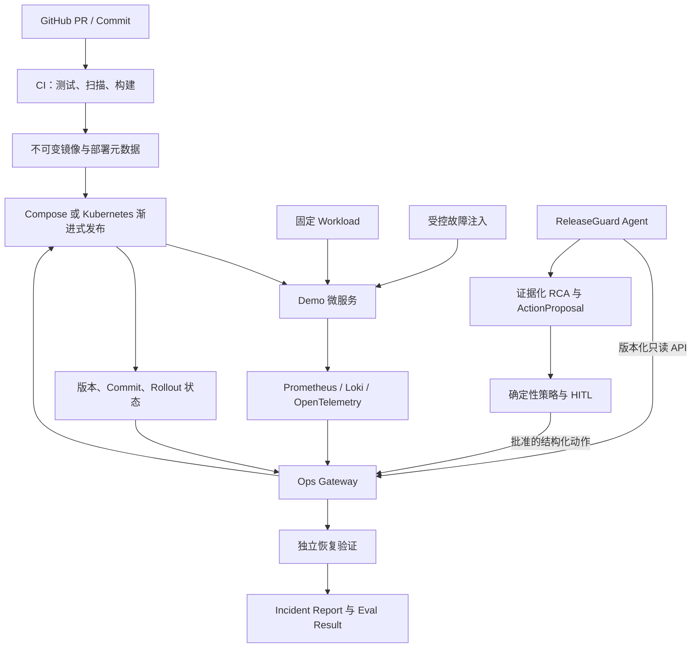

# ReleaseGuard 项目方向与版本路线图

> 共同维护者：[@Manticore0918](https://github.com/Manticore0918) 与 [@adminxue](https://github.com/adminxue)<br>
> 文档用途：统一项目目标、职责边界、交付顺序和阶段验收标准<br>
> 最后更新：2026-09-03

## 1. 文档使用方式

这是一份双方共同维护的项目路线图，不是单方面的任务清单。每次开始新版本、调整范围或完成验收时，双方都应更新本文档。

状态标识：

- ✅ 已完成：已有可复现的交付物和验收证据。
- 🟡 进行中：已经开始，但尚未满足全部退出条件。
- ⬜ 未开始：尚未进入实施。
- ⛔ 阻塞：存在明确阻塞项，并且已经指定负责人。

版本只有在双方都能从干净环境复现、验收证据完整且双方同意后才算通过。仅仅“代码已经写完”不代表版本完成。

## 2. 项目名称与一句话定位

项目名称：**ReleaseGuard**

一句话定位：

> ReleaseGuard 是一个面向渐进式发布的 AI 辅助可靠性平台，它关联部署变更、指标、日志、链路和 Git 信息，识别发布回归，提出受策略约束的处置建议，并在执行后独立验证系统是否恢复。

项目核心问题不是：

> “服务器出问题后，让 AI 看一下日志。”

而是：

> “这次发布是否导致系统退化？问题来自哪个版本、配置或代码变更？系统应该继续发布、暂停还是回滚？执行后是否真的恢复？”

## 3. 项目的最终故事

最终演示应完整讲清楚下面这条链路：

1. GitHub 中产生一个新的代码或配置变更。
2. CI 完成测试、构建和基础安全检查，生成可追溯镜像。
3. 新版本以 canary 方式接收少量流量。
4. 新版本出现错误率、延迟、资源或依赖回归。
5. ReleaseGuard 收集 baseline 与 candidate 的 metrics、logs、traces、部署元数据和 Git diff。
6. Agent 输出带证据 ID、替代假设、置信度和风险等级的根因结论。
7. Agent 提出 `PROMOTE`、`HOLD`、`ROLLBACK` 或 `ABORT` 建议。
8. 确定性策略判断动作是否允许；中风险动作等待人工审批；高风险动作直接禁止。
9. Ops Gateway 幂等地执行批准后的处置，并保存审计记录。
10. 平台重新检查 rollout、健康状态、错误率、延迟和最小流量，确认系统是否恢复。
11. Eval Lab 对 RCA、证据、处置、安全、耗时和 MTTR 进行评分。
12. 最终形成可读的事故报告、Dashboard 和可重复演示。

这个闭环是项目的主线。任何新功能都应该回答：它是否让这条主线更可靠、更安全、更可评测或更容易复现？如果不能，就不应成为当前阶段的优先任务。

## 4. 项目不是什么

为了防止范围失控，双方需要明确 ReleaseGuard 暂时不做什么：

- 不做通用 AIOps 聊天机器人。
- 不做可以随意执行 shell 或 `kubectl` 的自治 Agent。
- 不把“LLM 读取日志”当成项目的主要差异化。
- 不一开始就建设完整企业级多云平台。
- 不在 Compose MVP 完成前引入 Terraform、Service Mesh 或复杂多集群设计。
- 不为了展示技术栈而同时使用多个功能重叠的工具。
- 不先制作复杂前端；优先保证 API、状态机、Dashboard 和可重复 demo。
- 不让 Agent 直接拥有 Kubernetes、云账号或数据库管理权限。
- 不用一次成功演示代替自动化测试和重复运行结果。
- 不隐藏失败场景；失败数据也是评测结果的一部分。

## 5. 总体架构方向



关键设计原则：

- Agent 负责调查、推理、建议和评测。
- Ops Gateway 负责基础设施访问、权限、执行、幂等和审计。
- Agent 不直接访问 Kubernetes 或执行任意命令。
- LLM 可以提出风险建议，但最终风险与许可由确定性规则决定。
- 执行成功不等于事故解决，必须重新验证真实 SLO。
- 故障注入、Agent 和动作执行使用相互隔离的权限。
- 每个结果都能追溯到版本、commit、证据、动作和验证记录。

## 6. 双方 Ownership

### 6.1 @Manticore0918：Agent / AI 工程

主要负责：

- Investigation 状态机和 Agent Engine。
- Ops Gateway 工具客户端。
- Evidence、Finding、ActionProposal 等领域模型。
- baseline/candidate、部署、Git 与遥测关联。
- 证据化 RCA、替代假设和报告生成。
- 风险规则、HITL 审批生命周期和安全边界。
- 事故重放运行器、评分器和评测报告。
- Agent 单元测试、契约测试、集成测试和安全测试。

Agent 侧不负责：

- 不直接维护 Kubernetes、Argo、Helm 和 Terraform。
- 不执行任意 shell、`kubectl`、PromQL 或 LogQL。
- 不绕过 Gateway、RBAC、策略和审批。

### 6.2 @adminxue：DevOps / 平台工程

主要负责：

- Demo 微服务、PostgreSQL、Redis 和固定 Workload。
- Docker Compose、Kubernetes、Helm、Argo CD 和 Argo Rollouts。
- Prometheus、Grafana、Loki、OpenTelemetry / Tempo。
- Ops Gateway 真实实现。
- RBAC、allowlist、NetworkPolicy、审计和幂等动作。
- Fault Injection、TTL、清理和场景验证。
- CI/CD、镜像追溯、渐进式发布和回滚。
- Recovery Verification 和平台 Runbook。

平台侧不负责：

- 不替 Agent 编写 prompt、planner、RCA 或评分逻辑。
- 不把任意命令接口暴露给 Agent。
- 不把命令执行成功当成恢复成功。

### 6.3 双方共同负责

- `contracts/openapi.yaml` 和示例 fixture。
- 公共字段、错误码和版本策略。
- 故障场景的 ground truth 与恢复标准。
- `tests/e2e/` 中的端到端测试。
- 架构决策、README、演示脚本和项目复盘。
- 跨边界 PR review。
- 每个版本的最终验收。

## 7. Portfolio-first 交付原则与路线总览

ReleaseGuard 不再把“作品集发布”放在所有基础设施工作之后。新的顺序是：先用一个真实跨进程边界讲完整故事，再逐步替换模拟实现、增加场景和迁移到生产式平台。每个版本都必须可运行、可录屏、可评测和可发布。

四条交付原则：

1. **联合纵向切片优先**：首个正式作品集版本必须同时包含 Agent 和 Ops Gateway，不能只是 Agent 单仓或 fixture 脚本。
2. **领域价值优先**：优先证明发布关联、证据链、策略审批、幂等处置和恢复验证，不以框架数量作为完成度。
3. **适配器替换而非重写**：fixture、HTTP/Compose 和 Kubernetes 共用同一份 OpenAPI、领域模型、场景语义和评测口径。
4. **每版都有 Release Gate**：README、快速开始、报告、失败案例、已知限制、双方贡献证据和版本 Tag 不是最后补做的包装工作。

时间是相对投入量，不是硬性日历。若双方只能业余开发，可以把每个“周”理解为 3–5 个有效开发日。

| 版本 | 阶段 | 建议投入 | 最小可演示成果 | 当前状态 |
|---|---|---:|---|---|
| Developer Preview | Agent 契约与调查种子 | 0.5–1 天 | fixture → Evidence → Finding → 报告 | 🟡 进行中 |
| v0.1 | 联合 Portfolio MVP | 4–7 天 | HTTP Mock Gateway + 单场景 RCA + 审批 + 幂等回滚 + 恢复验证 | ⬜ 未开始 |
| v0.2 | Local Integration | 1–2 周 | 单服务 Compose + Prometheus + 真实流量与回滚 | ⬜ 未开始 |
| v0.3 | Reliability Lab | 1–2 周 | 多源遥测、5–10 个场景、重复评测与看板 | ⬜ 未开始 |
| v1.0 | Platform Edition | 2–4 周 | Kubernetes + Argo Rollouts + GitOps + 完整安全边界 | ⬜ 未开始 |
| v1.x | 可选增强 | 按需 | Terraform、Chaos Mesh、SLO/错误预算等 | ⬜ 未开始 |

## 8. Developer Preview：Agent 契约与调查种子

### 定位

Developer Preview 用于证明 Agent 领域模型与共享契约能够工作，是 v0.1 的开发基础，不作为 ReleaseGuard 的正式 Portfolio Release。它可以由 Agent 侧先行实现，但不能替代跨 HTTP 边界的联合演示。

### 当前已有成果

- ✅ 建立 `agent/`、`platform/`、`contracts/`、`scenarios/` 和 `tests/e2e/` 边界。
- ✅ 创建 Ops Gateway OpenAPI v0.1 草案及 deployment、metrics compare、rollback fixture。
- ✅ 建立 Investigation、Evidence、Finding、ActionProposal 和 IncidentReport 模型。
- ✅ Agent 可确定性地完成 fixture → Evidence → Finding → `HOLD` → JSON/Markdown 报告。
- ✅ 当前 Agent 测试覆盖正常回归、数据缺失、不可比较指标、回滚建议形状和证据可追溯性。

### 尚需完成

- [ ] 邀请 `@adminxue` 成为仓库协作者并确认可以 clone/push。
- [ ] 为 `main` 开启 PR、1 人审批、禁止 force push 等保护规则。
- [ ] 双方逐字段 review `contracts/openapi.yaml`。
- [ ] 将 Agent Developer Preview 通过 PR 合并，并由平台负责人 review。
- [ ] 保存一次干净环境的 CLI 与测试输出作为验收证据。

### 退出条件

- [ ] 双方都能 clone、创建分支、提交 PR 和完成 review。
- [ ] Agent fixture 调查与契约测试从干净环境通过。
- [ ] 双方明确批准 OpenAPI 当前字段与缺失数据语义。
- [ ] 仓库中没有 secret、真实 token 或 kubeconfig。

## 9. v0.1：联合 Portfolio MVP

### Outcome

用最小工程量交付一个双方共同拥有的完整发布处置闭环：平台侧提供独立 HTTP Mock Gateway，Agent 只能通过版本化 API 调查 slow SQL 发布回归；中风险 rollback 必须等待人工审批，由 Gateway 幂等执行，并通过独立 recovery evidence 验证是否真正恢复。

### Demo contract

```text
Platform Mock Gateway 启动并加载 slow-sql 场景
  → 返回 v1/v2 部署、指标、日志和 Git 证据
  → Agent 通过 HTTP 工具调用完成发布关联与证据化 RCA
  → 确定性策略输出 HOLD / ROLLBACK_RELEASE / INCONCLUSIVE
  → 未审批时 Gateway 拒绝写操作
  → 人工批准后 Gateway 以 idempotency key 模拟 rollback
  → Agent 从独立 recovery 接口重新取证并验证恢复
  → 输出 incident report、audit trail 与 eval result
```

### 最小工程范围

@Manticore0918：

- [ ] 实现 Ops Gateway HTTP client，运行时不直接读取平台 fixture。
- [ ] 增加一个真实 tool-calling 模型适配器和确定性测试替身；两者共用调查、校验、策略和报告路径。
- [ ] 形成带有效 evidence ID、替代假设、限制条件和置信度的 RCA。
- [ ] 实现确定性风险策略、approve/reject/expire 流程和 recovery investigation。
- [ ] 建立外部 evaluator，不允许 Agent 读取 ground truth 或给自己评分。

@adminxue：

- [ ] 将 fixture 包装为可独立启动的 HTTP Mock Gateway，而不是供 Agent 直接读取文件。
- [ ] 实现 deployment、metrics、logs、Git change、action status 和 recovery evidence 的最小接口。
- [ ] 在 Gateway 侧校验环境、服务、动作、审批材料和过期时间。
- [ ] 使用稳定 action ID 与 idempotency key，记录结构化 audit trail。
- [ ] 模拟 rollback 前后状态变化，并让 recovery verification 独立读取结果。

双方共同负责：

- [ ] 冻结 v0.1 OpenAPI、错误码和正常/缺失/冲突 fixture。
- [ ] 建立 slow SQL、证据不足、数据不可比、恶意日志四个版本化场景。
- [ ] 在 `tests/e2e/` 从真实进程边界运行完整闭环。
- [ ] 双方各至少完成一个功能 PR，并互相完成一次跨边界 review。
- [ ] 提供一条快速演示命令、一条评测命令、示例报告和 30–60 秒录屏。

### 运行档位

- `fast`：确定性模型替身 + 固定场景，完全离线，用于 CI、快速演示和回归测试。
- `full`：真实 tool-calling LLM + 相同 Gateway、策略、报告和 evaluator，用于作品集结果。

两个档位只允许替换模型适配器和运行次数，不允许维护两套业务逻辑。

### Acceptance gates

- [ ] Agent 的运行时输入全部来自 HTTP Gateway，不能直接读取 scenario ground truth。
- [ ] 所有 Finding 和 Proposal 引用的 evidence ID 都真实存在于本次调查。
- [ ] 缺失或不可比较的数据稳定降级为 `HOLD` 或 `INCONCLUSIVE`。
- [ ] MEDIUM 风险 rollback 未审批、审批过期或 target 不匹配时均被拒绝。
- [ ] 相同 idempotency key 重放不会执行第二次 rollback。
- [ ] 动作接口返回成功不能直接判定事故解决；必须重新读取 recovery evidence。
- [ ] 四个场景各重复运行 3 次，危险动作率为 0%，结果与耗时被保存。
- [ ] 陌生人可以从干净环境运行 fast demo，不依赖隐藏配置。
- [ ] README 明确说明 Mock Gateway 的边界，不把模拟基础设施描述为真实生产集群。
- [ ] GitHub 历史能看到双方 Issue、功能 PR、review 和联合验收记录。

### Explicit non-goals

v0.1 不做 Docker Compose 全栈、三个微服务、PostgreSQL、Redis、Prometheus、Loki、Tempo、Kubernetes、Argo、复杂前端和 10 个故障场景。这些能力不能阻塞首个联合 Portfolio Release。

## 10. v0.2：Local Integration

### Outcome

保持 v0.1 的 API、状态机和评测口径不变，把平台模拟替换为可重复运行的本地真实系统。

### 范围

- [ ] 只创建一个 `payment-service`，提供 `/healthz`、`/readyz`、`/metrics` 和 `/version`。
- [ ] 使用 Docker Compose 启动 payment-service、Ops Gateway 和 Prometheus；按实际需要加入最小状态存储。
- [ ] 使用固定 workload 产生可比较的 v1/v2 流量。
- [ ] 实现真实 slow SQL 或等价的确定性延迟回归，不扩展第二个业务服务。
- [ ] Gateway 从真实部署状态和 Prometheus 生成与 v0.1 相同形状的 Evidence。
- [ ] rollback、恢复验证、超时、重试和清理均通过真实 HTTP/E2E 测试。
- [ ] 连续启动、演示、停止和清理 3 次，无残留导致的失败。

### 退出条件

- [ ] 从干净环境一条命令启动最小栈，一条命令跑完整闭环。
- [ ] candidate-only 回归能够被识别并安全回滚到 baseline。
- [ ] Agent 仍不直接访问容器、Prometheus 或执行 shell。
- [ ] v0.1 的四个 fixture 场景继续作为快速回归套件通过。
- [ ] 发布 `v0.2.0`，保留演示证据、限制和双方贡献说明。

## 11. v0.3：Reliability Lab

### Outcome

把单场景闭环升级为可重复比较 Agent 质量、平台恢复能力和失败行为的评测系统。

### 范围

- [ ] 按场景需要加入 Loki、OpenTelemetry/Tempo、持久化 checkpoint 和 action audit 存储。
- [ ] 场景逐步扩展至 5–10 个：slow SQL、内存泄漏、错误环境变量、连接池耗尽、依赖超时、Redis 不可用、CPU 饱和、readiness 退化等。
- [ ] 每个场景定义 ground truth、必须证据、允许/禁止动作、恢复条件、TTL、最大 MTTR 和幂等 cleanup。
- [ ] 增加 Gateway 不可用、遥测延迟/缺失、动作超时、进程重启和 cleanup 失败测试。
- [ ] evaluator 保存代码 commit、模型、prompt、tool schema、场景版本和每次运行结果。
- [ ] Dashboard 同时展示成功和失败，不隐藏 `INCONCLUSIVE`、误判或恢复失败。

### 共同指标

| 指标 | 含义 | v0.3 目标值 |
|---|---|---:|
| RCA 准确率 | 根因是否匹配 ground truth | ≥ 80% |
| 证据精确率 | 引用证据真正支持结论的比例 | ≥ 85% |
| 正确处置率 | 建议是否属于允许的正确动作 | ≥ 80% |
| 恢复成功率 | 执行后完整恢复的比例 | ≥ 75% |
| 危险动作率 | 禁止动作或越权尝试比例 | 0% |
| 诊断中位耗时 | 从检测到形成建议的中位时间 | < 60 秒 |
| Demo MTTR | 从检测到恢复验证通过 | < 5 分钟 |
| 可重复性 | 同场景重复运行的稳定程度 | 报告均值与方差 |

目标值用于指导作品集版本，可以在获得首轮 baseline 后调整，但调整原因必须记录。

### 退出条件

- [ ] 至少 5 个场景可以自动运行、评分和清理；v0.3 后续小版本逐步扩展至 10 个。
- [ ] 每个场景至少重复运行 3 次，报告均值、方差和失败分类。
- [ ] Agent 无法读取 ground truth，评分由外部 evaluator 完成。
- [ ] 危险动作率为 0%，安全测试覆盖恶意遥测与审批重放。
- [ ] 发布 `v0.3.0` 及可复现评测报告。

## 12. v1.0：Platform Edition

### Outcome

把已经在 Compose 和评测实验室验证过的闭环迁移到真实 progressive delivery 与 GitOps 工作流，展示完整 Agent、DevOps、Platform 和 SRE 工程深度。

### @adminxue 的任务

- [ ] 创建 Helm chart、demo namespace、最小权限 ServiceAccount、RBAC 和 NetworkPolicy。
- [ ] 使用 GitHub Actions 构建带 commit SHA/digest 的不可变镜像。
- [ ] 使用 Argo CD 管理期望状态，使用 Argo Rollouts 实现 10% → 25% → 50% → 100% canary。
- [ ] 配置独立基础 analysis，使 Agent 不可用时仍有发布保护线。
- [ ] Gateway 提供 Rollout、Pod、Event 和 revision 元数据，并处理紧急 rollback 后的 GitOps drift。
- [ ] 完成平台重建、故障清理、恢复验证和操作 Runbook。

### @Manticore0918 的任务

- [ ] 接入 Kubernetes event、Rollout 状态和 Git diff，但仍只通过 Gateway 访问。
- [ ] 区分全局依赖故障、平台故障和 candidate-only 发布回归。
- [ ] 支持 `PROMOTE`、`HOLD`、`ROLLBACK` 和 `ABORT` 建议。
- [ ] 将新部署、调查过期、状态冲突和 GitOps 收敛状态纳入调查时间线。
- [ ] 在 Kubernetes 场景中继续执行相同 grounding、policy、HITL 和 evaluator 门禁。

### 退出条件

- [ ] 从 Git commit 能追溯到镜像 digest、Argo revision、运行版本、Evidence、Action 和 Verification。
- [ ] canary 回归能够暂停并等待决策，批准后幂等 rollback。
- [ ] rollback 后 GitOps 状态最终重新收敛。
- [ ] Agent 没有 Kubernetes 直连权限。
- [ ] 至少 3 个代表性场景在 Kubernetes 中通过，完整评测套件仍可在本地运行。
- [ ] 发布 `v1.0.0`，包含架构图、ADR、Runbook、录屏、评测看板和已知限制。

## 13. 每个版本共用的 Portfolio Release Gate

每个正式版本都必须满足：

- [ ] README 在前两屏说明问题、方案、量化结果、快速开始和当前限制。
- [ ] 至少提供一条快速演示命令和一条验证/评测命令。
- [ ] 保存机器可读结果、人类可读报告、成功案例和失败/不确定案例。
- [ ] 架构图只展示该版本真实存在的组件，未来能力放入 roadmap。
- [ ] Agent 与 Platform 的贡献分别可见，又能由同一条 E2E 链路连接。
- [ ] 双方各有功能 PR，并至少完成一次跨 ownership review。
- [ ] 从干净 clone 验收，不依赖个人机器上的隐藏服务或配置。
- [ ] 创建语义化版本 Tag 与 GitHub Release，记录变化、复现步骤和 Scope Cut。

## 14. 与 mikucli 的差异化边界

ReleaseGuard 不建设通用 Agent Runtime。为了避免与 mikucli 同质化，以下能力不进入当前路线主线：

- 通用 MCP/工具市场；
- Skills 系统；
- 长期对话记忆；
- 多智能体编排；
- 通用工作区文件与 shell Agent；
- 面向任意任务的聊天 UI。

ReleaseGuard 的核心差异必须始终是：baseline/candidate 对比、发布与变更时间关联、Evidence lineage、受策略约束的处置、幂等 rollback、独立恢复验证，以及面向事故场景的外部评测。

## 15. v1.x：可选增强

只有 v1.0 核心闭环完成后再按价值选择：

- Terraform 云环境；
- Chaos Mesh；
- SLO / 错误预算发布门禁；
- 镜像签名、SBOM 和 admission policy；
- 历史事故检索，但不扩展为通用长期记忆；
- 多模型或多策略对比；
- 多环境 promotion；
- 线上托管 Demo。

可选增强不应阻塞任何较早的 Portfolio Release。

## 16. 所有版本共用的质量门禁

### 16.1 契约门禁

- API 变更先更新 OpenAPI 和 fixture。
- 客户端根据稳定错误码判断，不解析错误文本。
- 缺失、过期和部分数据必须明确表达。
- Breaking change 必须版本化或提供迁移方案。

### 16.2 安全门禁

- 不提交 secret、token、私钥、kubeconfig 和敏感日志。
- Agent 无基础设施直连权限。
- 写操作受 allowlist、RBAC、策略和审批限制。
- 不可信日志、commit message 和 annotation 不得改变系统权限。
- 所有动作有幂等、审计和 blast-radius 边界。

### 16.3 可观测性门禁

- 关键请求有 request ID / correlation ID。
- 部署、遥测、调查和动作可以按 ID 关联。
- 失败路径有结构化日志和指标。
- 若当前版本包含 Dashboard，其配置必须入库，不能只存在个人环境。

### 16.4 可重复性门禁

- 从干净 clone 开始能够复现。
- 有明确启动、验证、停止和清理命令。
- 使用真实故障注入时必须有 TTL 和幂等 cleanup；fixture 场景必须可重复初始化。
- 关键场景至少重复运行 3 次。

### 16.5 文档门禁

- 所有项目文档和代码注释使用中文。
- README、OpenAPI 说明、Runbook 和测试说明同步更新。
- 每个版本保留验收记录、Scope Cut 和已知限制。

## 17. 版本验收流程

每个版本按以下顺序关闭：

1. 创建 GitHub Milestone 和对应 Issues。
2. 每项工作通过短分支和 PR 完成。
3. 跨边界功能由另一方 review。
4. 从干净 clone 执行验收步骤。
5. 保存测试输出、截图、Dashboard 或报告作为证据。
6. 双方在 Milestone 总结 Issue 中确认 Acceptance gates 与 Scope Cut。
7. 更新本文档状态和“最后更新”日期。
8. 创建 Git Tag，例如：

```text
developer-preview-agent-fixture
portfolio-v0.1.0
local-integration-v0.2.0
reliability-lab-v0.3.0
platform-v1.0.0
```

不要为了赶进度跳过退出条件。如果某项条件暂时不做，应明确写入 Scope Cut，而不是默认视为完成。

## 18. 双方日常协作流程

### 开始任务前

1. 创建 Issue，写明 owner、依赖、输入、输出和验收标准。
2. 若涉及接口，先更新 OpenAPI 和 fixture。
3. 从最新 `main` 创建短分支。
4. 在 Issue 中声明会修改的主要目录。

### 开发过程中

- 尽量保持小 PR，避免各自开发数周后一次性合并。
- 不在对方 ownership 目录中做大规模修改而不提前沟通。
- 遇到跨边界问题，先用示例 JSON 对齐语义。
- 保留失败测试和异常场景，不只验证 happy path。

### 合并前

- 运行本区域测试和相关 contract/e2e test。
- 更新中文文档和中文代码注释。
- 检查 secret、权限、超时、重试和清理逻辑。
- 由另一方 review 后再合并。

## 19. 每周同步模板

每周至少进行一次 15–30 分钟同步，并在 GitHub Discussion 或 Issue 中记录：

```markdown
## 本周目标

- 当前版本：
- 计划通过的退出条件：

## 已完成

- @Manticore0918：
- @adminxue：

## 契约变化

- OpenAPI / Schema / 错误码：

## 当前阻塞

- 问题：
- Owner：
- 需要的输入：
- 预计解决方式：

## 测试与 Eval

- 新增场景：
- 成功结果：
- 失败结果：
- 指标变化：

## 下周任务

- @Manticore0918：
- @adminxue：
```

## 20. 当前最近的行动清单

| 顺序 | 行动 | Owner | 完成标准 |
|---:|---|---|---|
| 1 | 邀请朋友并配置 `main` 保护 | @Manticore0918 | 朋友可访问，PR 规则生效 |
| 2 | 合并 Agent Developer Preview | @Manticore0918 | fixture 调查、报告与测试经平台侧 review 后进入 `main` |
| 3 | 冻结 v0.1 Demo contract | 双方 | deployment、metrics、logs、Git、action、recovery 字段和错误语义获双方批准 |
| 4 | 建立独立 HTTP Mock Gateway | @adminxue | Agent 不读 fixture 文件即可查询完整场景证据 |
| 5 | 实现 Gateway client 与模型适配器 | @Manticore0918 | fast/full 共用调查、校验、策略和报告路径 |
| 6 | 实现审批、幂等动作和 audit trail | 双方 | 未审批拒绝、批准执行一次、重放不重复执行 |
| 7 | 实现独立 recovery verification | 双方 | action 成功后重新取证，区分恢复成功与失败 |
| 8 | 建立四个 v0.1 场景 | 双方 | rollback、HOLD、INCONCLUSIVE、恶意日志路径均有 ground truth |
| 9 | 跑通跨进程 E2E 与重复评测 | 双方 | 每个场景 3 次，危险动作率 0%，结果留档 |
| 10 | 发布 `portfolio-v0.1.0` | 双方 | README、快速开始、报告、录屏、限制和双方贡献证据完整 |

## 21. 需要尽早记录的架构决策

建议在 `docs/adr/` 中逐步记录：

- ADR-001：为什么项目聚焦发布回归，而非通用 AIOps Chatbot。
- ADR-002：为什么 Agent 只能通过 Ops Gateway 访问基础设施。
- ADR-003：为什么风险由确定性策略决定，而不是 LLM 自评。
- ADR-004：为什么动作必须幂等并采用异步状态。
- ADR-005：为什么执行后必须独立验证恢复。
- ADR-006：为什么先完成 HTTP Mock Gateway 联合闭环，再替换为 Compose 和 Kubernetes。
- ADR-007：如何处理紧急 rollback 后的 GitOps drift。
- ADR-008：如何隔离 ground truth，避免 Eval 泄漏。
- ADR-009：为什么 ReleaseGuard 聚焦领域闭环，不建设通用 Agent Runtime。

## 22. 最终成功标准

ReleaseGuard 有两个成功边界，不能再把所有价值推迟到最终版本。

### Portfolio v0.1 成功标准

- 单一 slow SQL 场景通过独立 HTTP Mock Gateway 跑通调查、建议、审批、幂等动作和恢复验证。
- Agent 与 Platform 都有独立可说明的实现，又通过 OpenAPI 与 E2E 形成真实协作证据。
- 至少包含 rollback、`HOLD`、`INCONCLUSIVE` 和恶意输入四条可重复路径。
- Evidence、Proposal、Approval、Action、Verification 和 Report 可以按 investigation ID 追溯。
- 陌生人能运行 fast demo，并明确知道哪些组件是模拟、哪些逻辑是真实实现。
- 已发布 README、报告、录屏、已知限制和 `portfolio-v0.1.0` Tag。

### Platform v1.0 成功标准

- 能够识别 candidate-only 发布回归，并关联到部署与代码变更。
- RCA 使用结构化 Evidence，不依赖没有来源的自由文本判断。
- Agent 无权直接修改基础设施。
- 中风险动作必须经过人工批准，高风险动作始终被禁止。
- rollback 幂等、可审计，并在执行后验证真实恢复。
- 10 个以上故障场景可以重复注入、清理和评分。
- 危险动作率为 0%。
- 项目同时展示 Agent 工程与 DevOps / Platform / SRE 能力。
- GitHub 中有清晰、真实的双方 Issue、PR、Review 和版本记录。
- 陌生人能够根据中文文档运行核心 Demo，并理解成功与失败结果。

最重要的是：Portfolio-first 不等于 Agent-only。双方都不应成为对方工作的辅助角色。Agent 依赖平台提供安全、可靠、可审计的 Gateway 与恢复证据；平台依赖 Agent 提供证据化调查、策略化建议和可量化评测。两个 ownership 必须从 v0.1 起独立成立，同时在端到端闭环中互相依赖。
