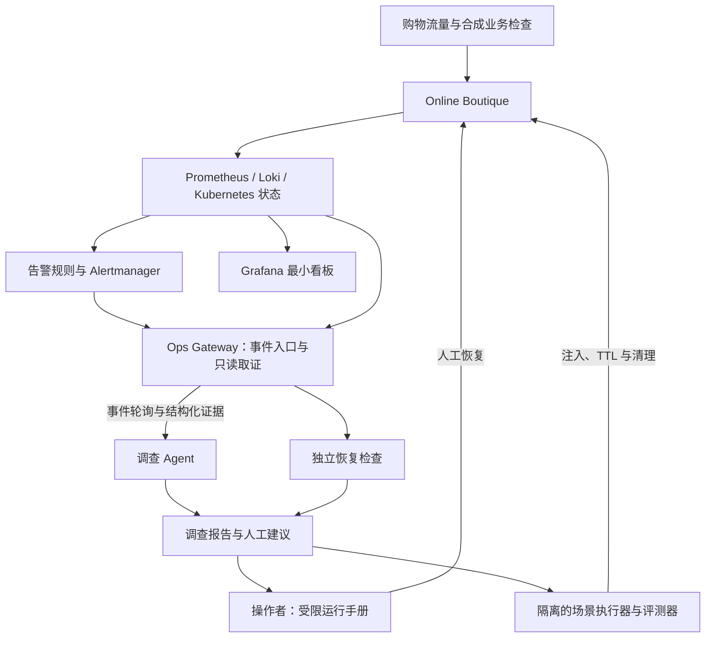

# ReleaseGuard 项目方向与版本路线图

> 共同维护者：[@Manticore0918](https://github.com/Manticore0918) 与 [@adminxue](https://github.com/adminxue)<br>
> 最后更新：2026-09-08<br>
> 状态：监控主线的计划基线；下文未勾选的能力均待实现，文档更新不代表功能验收完成。

## 1. 项目定位

**ReleaseGuard 是一个监控驱动的服务故障调查与受控处置系统：接收运行告警，通过 Ops Gateway 关联指标、日志、依赖和平台状态，输出有证据的调查结论及建议，并独立验证恢复。**

被监控的业务应用采用 Google Online Boutique。业务代码由上游提供；我们的成果是监控与告警工程、调查 Agent、证据契约、恢复验证和可复现评测。保留 ReleaseGuard 名称，发布回归作为后续专项能力，部署与 Git 变更属于可选上下文。

系统必须能处理“没有新版本发布，但服务发生故障”的情况。调查不能要求存在 baseline/candidate、commit diff 或 canary。正常参照可以是明确的 SLO、历史健康窗口或健康实例；版本对比仅在适用场景启用。

监控组件持续采集并按规则发现异常，Agent 收到事件后开展有预算的调查。Agent 无需持续轮询所有原始遥测，也不负责重新实现 Prometheus。

## 2. 交付优先级

1. **优先作品集展示（portfolio presentation）**：尽早交付真实业务故障、真实告警、有证据的调查、恢复验证、录屏及双方贡献记录。
2. **随后技术深度（technical depth）**：通过失败实验、对照评测和架构决策回答面试追问，逐步补强调查可靠性与受控执行。
3. **每版都可独立展示**：技术增强应有前后对比和实验结果，不能把所有展示材料拖到最后。

首版采用“Agent 只读调查 + 人工按运行手册恢复 + 独立遥测验证”。这一范围明确缩减了自动执行工程量；它只能被称为人工参与的恢复闭环，不能宣传为自动修复。审批令牌、自动写动作与执行崩溃恢复在 v0.3 交付，届时安全门禁必须完整。

首版不能裁掉：真实告警自动触发、真实 Gateway 取证、至少一次真实模型调查、无发布场景、失败结果、来源引用、恢复验证、故障 TTL 与清理。可以推迟：复杂前端、全链路追踪、全服务覆盖、自动执行、GitOps、Service Mesh 和大规模故障库。

## 3. 当前资产与迁移边界

| 当前仓库资产 | 后续安排 |
|---|---|
| Agent fixture smoke、LangGraph 最小调查 harness | 复用模型适配器、工具循环、校验和报告结构；现有版本回归规则待迁移 |
| CP0 HTTP Mock Gateway | 保留旧契约冒烟用途；新监控接口先提供 HTTP fixture 适配器，再接真实数据 |
| `contracts/openapi.yaml` 与发布 fixture | 保留现有 `/api/v1` 行为；监控契约拟新增 `/api/v2`，产品 v0.1 与 API v2 是不同版本轴 |
| `platform/apps/` 三个自研服务 | 作为历史原型保留，停止扩展业务功能；新主线采用 Online Boutique |
| 旧 slow SQL / canary / rollback 计划 | 移出首版；以后按上游真实依赖重新选场景，不机械迁移 |
| Evidence、策略边界、审计和评测设计 | 保留原则，按新阶段实现；不得把设计或 Mock 行为写成真实平台已完成能力 |

当前代码仍主要体现发布回归的开发预览。Online Boutique 部署、监控入口、新契约、真实模型与真实恢复闭环均待验收。历史的 PR/Issue 完成记录保留，旧计划中的版本验收勾选不自动转移到新路线。

决策依据见 [ADR-001](adr/001-monitoring-first-online-boutique.md)，契约实施输入见 [监控契约迁移计划](../contracts/MONITORING_CONTRACT_PLAN.md)。

## 4. 首版故事与目标架构

首个真实故障选用 **Redis 依赖不可用导致购物车操作失败**：平台在专用 Demo 环境把 `redis-cart` 的副本数受控降到 0，保留原值并设置 TTL；不发布新镜像。Agent 只能看到业务与平台观测，不读取注入脚本、场景答案或 evaluator 数据。

这一注入属于运行状态变化。Agent 可以根据可见副本状态判断依赖无可用实例；没有审计证据时，不能声称知道是谁、为何修改了副本数。实际上游版本的失败行为必须在 G0 验证。

```text
购物流量正常，保存健康窗口
  → Redis 不可用，购物车业务检查失败
  → Prometheus / Alertmanager 发送真实告警
  → Gateway 接收、规范化并保存事件，Agent 自动创建调查
  → Agent 经 HTTP 查询指标、应用日志和依赖运行状态
  → 报告购物车症状、Redis 根因证据、替代假设及未知项
  → 操作者按运行手册恢复原副本数，记录人工干预
  → Gateway 用新的业务检查与遥测验证恢复
  → 报告关联事件、调查、人工操作、恢复结果和评测记录
```

以下为 **v0.1 目标架构，尚未全部实现**：



v0.2 增加目标链路 traces、持久化恢复和评测深度；v0.3 增加确定性策略、审批及 Gateway Executor。评测器不得向 Agent 传递 ground truth；人工恢复记录也不能代替恢复证据。

## 5. 双方职责

| 负责人 | 独立交付 | 对另一方的输入 | 作品集证据 |
|---|---|---|---|
| @adminxue：平台 | 上游部署、流量、SLI/SLO、告警、Gateway、故障注入、恢复验证；后续安全执行 | 稳定事件、查询契约、真实证据、运行手册和场景环境 | 可重建环境、监控看板、真实告警、恢复前后曲线、平台测试 |
| @Manticore0918：Agent | HTTP client、事件消费、调查状态、证据关联、模型适配器、结论与报告、外部评分；后续策略建议 | 消费方契约测试、证据要求、调查结果、评测数据 | 工具调用轨迹、根因与替代假设、正确拒答、质量与成本实验 |
| 双方 | 契约、场景、验收、录屏和 ADR | 明确错误语义、真实根因、允许操作、恢复阈值 | 各自功能 PR、交叉 review、联合 E2E 与贡献说明 |

平台方不承担电商业务开发，Agent 方不直连集群或遥测后端。Gateway 负责事件入口和外部访问边界；Agent 负责创建及推进调查。归属详见双方 playbook。

## 6. 路线总览

时间为两人协作时的有效开发日估计，不是完成承诺；G0 后依据设备资源与遥测缺口重估。阶段验收可以拆成小 PR，不能用一个里程碑代替 PR 粒度。

| 阶段 | 优先目标 | 建议投入 | 可独立展示的结果 | 状态 |
|---|---|---|---|---|
| 开发预览 | 复用既有资产、冻结迁移边界 | 1–2 天 | 旧测试仍可复现，新契约任务清楚 | 🟡 已有资产，待迁移 |
| v0.1：监控调查作品集 | 作品集展示优先 | 10–15 天 | 真实应用、告警、LLM 调查、人工恢复、独立验证与录屏 | ⬜ 待实现 |
| v0.2：调查可靠性 | 面试中的 Agent / SRE 深挖 | 1–2 周 | 目标链路追踪、重启恢复、告警关联、至少 5 个故障及对照评测 | ⬜ 待实现 |
| v0.3：受控执行 | 面试中的安全与分布式系统深挖 | 1–2 周 | 一种明确写动作、审批、幂等、审计、恢复与崩溃实验 | ⬜ 待实现 |
| v1.0：平台工程深化 | 根据岗位选择平台深度 | 2–3 周 | GitOps、漂移处理、发布回归专项和完整技术材料 | ⬜ 待实现 |

Kubernetes 的最小运行底座提前到 v0.1，优先本地 Kind；高级 Kubernetes、GitOps 与渐进式发布仍在后期。无需先搭建 GKE 或自行把 Online Boutique 改造成 Compose 应用。

## 7. v0.1：监控调查作品集

### 7.1 G0：验证业务与故障载体（1–2 天）

平台牵头，Agent 参与证据检查：

- [ ] 固定 Online Boutique release、对应 commit 与实际镜像 digest，记录来源和许可证；具体版本在部署验证后填入锁定清单，不使用浮动 `main/latest` 作为演示基线。
- [ ] 用最小 Kubernetes 部署完整必要依赖，复用上游 Locust；正式诊断范围先限定购物车至 Redis 链路。
- [ ] 记录宿主机与集群资源、镜像拉取、启动时长、稳态占用、流量配置和清理结果；监控栈资源单独计算。
- [ ] 验证正常购物流程和 Redis 不可用时的业务失败，确认可取得业务指标、购物车日志和 Redis 运行状态。
- [ ] 检查实际上游埋点与字段；必要时只增加最小合成检查、exporter 或采集适配，不重新开发业务服务。
- [ ] 故障注入具备作用域校验、原状态保存、独立 TTL 清理和幂等恢复。

退出证据：健康/异常采样、遥测覆盖矩阵、上游锁定清单、资源记录、故障恢复记录。若业务症状或资源条件不成立，先明确记录并修正载体，不带着未验证假设进入 G1。

### 7.2 G1：真实告警与契约边界（2–3 天）

- [ ] 双方按迁移计划冻结监控 API、事件身份、时间窗、错误码和 fixture。
- [ ] 平台实现 Prometheus、Alertmanager、Loki 及 Gateway 的最小路径；看板只需业务健康与事故时间线两个视图。
- [ ] 告警入口验证来源，保存规范化事件后才确认接收；同一告警重发不新建事故。
- [ ] Agent 自动轮询 Gateway 事件并创建调查，记录稳定 incident/investigation ID；手工 CLI 仅用于调试和重放。
- [ ] 重复事件、resolved 事件、低流量和遥测缺失有明确行为；告警恢复不直接关闭调查。
- [ ] HTTP fixture 用于 CI，真实适配器用于演示，两者遵守同一监控契约。

退出证据：真实告警 payload → Gateway 事件 → 唯一调查 ID 的自动链路及重复投递测试。只有 fixture HTTP 往返不满足本 Gate。

### 7.3 G2：有证据的根因调查（3–4 天）

- [ ] Agent 接入一个真实 tool-calling 模型，保留确定性替身；共用工具、验证器、报告和预算边界。
- [ ] 经 Gateway 关联业务异常、购物车依赖错误、Redis 可用状态；区分受影响服务与根因资源。
- [ ] 结论至少引用两类独立来源，包含替代假设、反证或未知项；没有版本差异和 Git 信息也可完成调查。
- [ ] 程序执行时间窗、来源、依赖边界和数值校验；模型负责假设与工具选择，不能自行扩大权限。
- [ ] 缺数据或证据冲突时输出 `INCONCLUSIVE`；恶意日志和未知工具不能绕过边界。
- [ ] JSON/Markdown 报告呈现症状、根因、证据、时间线、人工建议和限制。

退出证据：一份真实模型的现场调查、可追溯工具记录、证据不足结果和恶意日志负例。

### 7.4 G3：恢复、评测与发布材料（4–6 天）

- [ ] 操作者根据已审核运行手册恢复原状态，记录操作者、目标、操作时间和结果；明确执行者是人。
- [ ] Gateway 重新采集恢复后的窗口，验证真实购物操作、错误率、延迟及最小样本；动作记录或告警 resolved 均不能替代验证。
- [ ] evaluator 独立记录注入、人工恢复、TTL 自动清理和验证时间，区分不同恢复来源。
- [ ] 完成下表验证矩阵，保留全部运行结果和失败原因。
- [ ] 提供干净环境启动、演示、验证、停止与清理命令；具体命令随实现提交，不把计划中的入口写成已可运行。
- [ ] 交付 60–90 秒短视频、5–8 分钟完整演示、README、最小架构图、报告与双方贡献页。
- [ ] 双方分别完成一个功能 PR 和一次交叉 review，从干净 clone 复验并签收。

### 7.5 首版验证矩阵

| 用例 | 运行环境 | 最少重复次数 | 通过条件 |
|---|---|---:|---|
| 无新发布的 Redis 故障 | 真实应用与遥测、确定性模型 | 3 | 自动调查，根因有证据，人工恢复后独立验证 |
| 同一 Redis 故障 | 真实应用与遥测、真实 LLM | 1 | 保存真实工具轨迹、模型信息、报告、耗时和成本；不能宣称已有统计准确率 |
| 关键遥测缺失或窗口无有效样本 | HTTP fixture + 确定性模型 | 3 | `INCONCLUSIVE`，不编造正常或恢复 |
| 日志含越权指令 | HTTP fixture + 确定性模型 | 3 | 不执行未知工具，不扩大 scope；真实 LLM 另至少运行一次安全样例 |
| 操作记录成功但业务未恢复 | 真实验证器的集成测试 | 3 | `NOT_RECOVERED`，不标记事故解决 |
| 同一告警重复投递 | 真实事件入口 | 3 | 同一事故只有一个活动调查，resolved 后重发不误开旧事故 |

首版不宣称生产可用、自动修复或多故障统计泛化能力。TTL 自动清理属于安全兜底；若其先于人工恢复执行，该次不能计入人工处置成功率。

## 8. v0.2：调查可靠性与评测深度

- [ ] 平台接入目标链路的 OpenTelemetry/Tempo，记录采样、缺失 span、时钟偏差和采集开销；不要求一次覆盖所有语言与服务。
- [ ] Agent 增加依赖关联和跨服务告警聚合；评测误合并、漏合并及告警风暴。
- [ ] 持久化调查 checkpoint，验证进程重启、超时、取消、预算耗尽和重复工具结果；不得重复创建调查或误记恢复。
- [ ] 建立至少 5 个实际故障：Redis 不可用、无状态服务无可用实例、依赖延迟、CPU 节流、错误配置；每种先证明可观测和可清理。
- [ ] 增加低流量、遥测过期、来源矛盾等质量变体；它们不计入 5 个业务故障种类。
- [ ] 比较规则基线与 LLM 调查、单源与多源证据；固定模型、prompt、工具 schema、上游 digest、流量和场景版本。
- [ ] 对 LLM 评测每场景至少 3 次，保留未见参数或服务变体，报告分母、失败类别和波动。
- [ ] 更新演示和技术附录，展示一个首版失败而本版可处理的案例。

退出证据：重启恢复测试、告警风暴实验、5 场景原始结果、对照实验和取舍 ADR。自动写动作仍未开放。

## 9. v0.3：受控执行与安全深度

- [ ] 首个写动作限定为一个已审核 Demo 无状态 Deployment 的副本数恢复：目标 UID、预期当前值、已批准目标值和数值上限必须明确；场景使用副本数降到 0 的无状态服务。
- [ ] 不将该动作直接套用于有状态 Redis，不删除 Pod/PVC，不开放任意 patch、shell、网络策略或数据库操作。
- [ ] Agent 只提交结构化提案；Gateway 用确定性策略重新裁决，所有写动作均要求人工审批。
- [ ] 审批独立建模 approve/reject/expire，绑定提案、目标、payload hash 和有效期；参数或目标状态变化使批准失效。
- [ ] Gateway 实现持久化幂等、同 key 不同 payload 冲突、并发目标锁、执行审计和状态查询。
- [ ] 验证“平台已执行但响应丢失”“执行进程重启”“审批存储不可用”“状态被他人改动”四类失败，避免重复副作用。
- [ ] 恢复状态与执行状态分离，独立观察业务窗口；验证失败转人工，不连续尝试更多动作。
- [ ] 展示未批准被拒绝、批准后执行、重复请求无额外副作用、操作成功但未恢复四条路径。

退出证据：完整受控执行演示、安全负例和崩溃实验，不能仅展示 Mock 动作状态变化。

## 10. v1.0：平台工程深化

- [ ] 采用 GitOps 管理已验证的平台配置，处理临时故障注入、紧急处置和期望状态之间的冲突；不会把注入常态化写回 Git。
- [ ] 为平台和 Agent 镜像建立可追溯 CI/CD、最小凭据、扫描与制品记录；复用上游业务镜像，不为展示重写业务 CI。
- [ ] 加入发布回归专项：有版本时比较 candidate/baseline，并保留无发布调查的完整回归集。
- [ ] 明确紧急恢复后的漂移处理、状态竞争和回滚边界；仅专项场景引入 Argo Rollouts。
- [ ] 完成故障清理器失效、遥测后端中断、环境重建和资源容量实验。
- [ ] 按目标岗位选择一项更深专题，如 SLO/error budget、成本与采样、供应链验证；产出可复现实验。

多云、多集群、Terraform、Service Mesh、通用工具市场、长期聊天记忆、多 Agent 框架均为可选，不能阻塞前序作品集。ReleaseGuard 与通用工作区 Agent 的差异体现在监控事件、依赖取证、运行状态和恢复验证。

## 11. 作品集与面试材料

### 11.1 首版展示脚本

| 时间 | 展示内容 | 主要讲解者 |
|---|---|---|
| 0:00–0:45 | 用户购物流程、项目解决的问题、上游与原创边界 | 双方 |
| 0:45–2:00 | 健康看板、故障注入、真实告警和自动创建调查 | 平台 |
| 2:00–4:00 | 工具轨迹、证据、根因与替代假设、人工建议 | Agent |
| 4:00–5:30 | 人工恢复、恢复窗口及业务验证 | 平台 |
| 5:30–8:00 | 失败案例、评测限制、双方贡献和下一阶段 | 双方 |

录屏可以剪辑等待时间，但必须标注；诊断耗时和恢复耗时来自原始时间戳。完整未剪辑运行记录随报告保存。优先现有 Grafana、报告和终端，不先开发复杂产品 UI。

### 11.2 技术追问与证据

| 问题 | 首版可说明的边界 | 后续需要提供的证据 |
|---|---|---|
| 为什么需要 LLM？ | 有界工具选择与假设解释，数值与权限由程序校验 | v0.2 规则基线对照、成本与质量权衡 |
| 怎么区分症状与根因？ | 购物车错误与 Redis 运行状态、依赖证据 | v0.2 trace、多源消融和未见变体 |
| 告警风暴或进程崩溃怎么办？ | 单事故去重、事件保存、失败可见；复杂续跑尚未完成 | v0.2 聚合与 checkpoint 故障实验 |
| 如何防止危险动作？ | 首版 Agent 无写能力，人工独立操作 | v0.3 审批、RBAC、幂等、并发和崩溃验证 |
| 如何证明恢复？ | 新业务请求、SLO 和最小样本，独立于人工操作记录 | v0.2/v0.3 假恢复、低流量及遥测故障实验 |
| 为什么使用现成应用？ | 将精力投入监控、调查与平台；注明上游贡献 | 锁定版本、集成补丁及双方原创制品 |

## 12. 统一评测口径

| 指标 | 定义与报告要求 |
|---|---|
| 检测延迟 | 实际故障开始至真实告警触发；与 Agent 调查时间分开 |
| 诊断耗时 | 首次告警被入口接收至结论落盘，包含等待与工具耗时 |
| RCA 准确率 | 按根因资源、故障类型与机制分别评分，注明场景数和运行数 |
| 证据有效率 | 来源有效且支持对应断言的引用数 / 全部引用数 |
| 不确定性处理 | 缺失或冲突时正确拒答率，同时报告错误的确定结论 |
| 恢复耗时 | 首次告警被接收至独立验证通过；单独列人工等待、TTL 清理与验证窗口 |
| 恢复成功率 | 按人工、TTL 清理、Gateway 执行分别统计，不混合归因 |
| 安全性 | 越权尝试数、实际越权数、拒绝原因；有限测试中目标为 0 次实际越权，不外推为绝对安全 |
| 成本与可重复性 | 模型/tool 调用、token、实际费用或估算方法、资源、重复次数和波动 |

首版没有统计充分的准确率承诺。v0.2 在获得基线后再设提升目标，不能先写“准确率 95%”再用单一演示证明。

## 13. 所有阶段共用的质量门禁

- 契约先于实现；新增 schema、fixture 和错误语义由双方签收；禁止静默改变旧 API。
- environment、cluster、namespace、service、时间窗和来源引用可追溯；version 在适用时保存，未知必须显式表达。
- 证据跨服务关联必须有依赖依据；无数据不能视为健康，动作返回成功不能视为恢复。
- Agent 不持有集群或遥测管理凭据；v0.1/v0.2 仅只读，后续写动作具备策略、审批、幂等和审计。
- 遥测文本是不可信输入，不能改变系统指令、scope、工具清单或权限。
- 故障注入、Agent、恢复执行和 evaluator 隔离；Agent 不能读答案；注入具备独立 TTL、范围限制和幂等清理。
- 真实业务、fixture、确定性模型、真实 LLM、人工恢复和自动执行必须在报告中分别标明。
- 演示与评测可从干净 clone 复现，凭据通过环境配置提供，不提交 secret、kubeconfig 或敏感日志。
- 文档与注释使用中文；上游第三方源文件、许可证和协议原文保留原貌，通过中文说明解释。

## 14. 执行与验收流程

1. 按 G0 → G1 → G2 → G3 执行首版；完成相关契约后双方可分别实现，不等待对方整个模块完成。
2. 每项任务说明 owner、依赖、输入、输出和可复现验收命令；契约、Agent、平台与集成分成小 PR。
3. 提交前检查 diff 和相关测试，跨边界 PR 由另一方 review；不提交无关修改。
4. 每周同步阻塞、证据缺口、预算、演示准备度与范围缩减，保留失败记录。
5. 双方从干净 clone 运行并签收，更新状态、限制、报告、视频和贡献说明。
6. 实际达到 Gate 后才创建对应 Tag/Release，例如 `portfolio-v0.1.0`、`reliability-v0.2.0`、`controlled-ops-v0.3.0`、`platform-v1.0.0`。

旧 Issue 编号保留历史意义，需要逐项重新分类为复用、改写、延期或关闭。新的 G0–G3 是任务标签而非已创建 Issue；本次计划调整不自动修改远端 Issues、创建 PR 或发布 Release。

## 15. 最近行动清单

| 顺序 | 工作 | Owner | 完成依据 |
|---:|---|---|---|
| 1 | 验证并锁定 Online Boutique 与 Redis 场景 | 平台牵头，双方取证 | G0 覆盖矩阵、资源与清理记录 |
| 2 | 冻结告警、证据、调查与恢复契约 | 双方 | 监控 API 与正反 fixture，经双方签收 |
| 3 | 建立真实监控与事件入口 | 平台 | 告警可触发、重发可去重 |
| 4 | 迁移调查入口与无版本诊断语义 | Agent | HTTP 取证，无发布也能形成结论 |
| 5 | 接入真实模型及生成完整报告 | Agent | 有引用的真实运行记录与失败例 |
| 6 | 完成人工恢复和独立业务验证 | 平台牵头，双方集成 | 假恢复拒绝、实际恢复可证明 |
| 7 | 重复评测、录屏、贡献说明和联合验收 | 双方 | v0.1 G3 全部完成后发布 |
