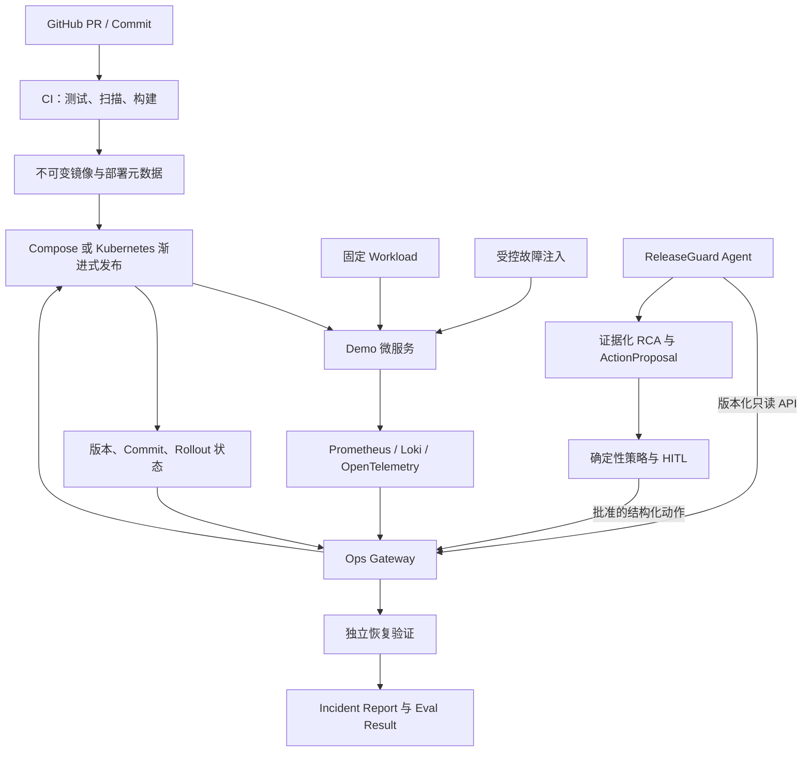

# ReleaseGuard 项目方向与阶段性 Checkpoint

> 共同维护者：[@Manticore0918](https://github.com/Manticore0918) 与 [@adminxue](https://github.com/adminxue)<br>
> 文档用途：统一项目目标、职责边界、交付顺序和阶段验收标准<br>
> 最后更新：2026-09-02

## 1. 文档使用方式

这是一份双方共同维护的项目路线图，不是单方面的任务清单。每次开始新阶段、调整范围或完成 Checkpoint 时，双方都应更新本文档。

状态标识：

- ✅ 已完成：已有可复现的交付物和验收证据。
- 🟡 进行中：已经开始，但尚未满足全部退出条件。
- ⬜ 未开始：尚未进入实施。
- ⛔ 阻塞：存在明确阻塞项，并且已经指定负责人。

Checkpoint 只有在双方都能从干净环境复现、验收证据完整且双方同意后才算通过。仅仅“代码已经写完”不代表 Checkpoint 完成。

## 2. 项目名称与一句话定位

项目名称：**ReleaseGuard**

一句话定位：

> ReleaseGuard 是一个面向渐进式发布的 AI 辅助可靠性平台，它关联部署变更、指标、日志、链路和 Git 信息，识别发布回归，提出受策略约束的处置建议，并在执行后独立验证系统是否恢复。

项目核心问题不是：

> “服务器出问题后，让 AI 看一下日志。”

而是：

> “这次发布是否导致系统退化？问题来自哪个版本、配置或代码变更？系统应该继续发布、暂停还是回滚？执行后是否真的恢复？”

## 3. 项目的最终故事

最终演示应完整讲清楚下面这条链路：

1. GitHub 中产生一个新的代码或配置变更。
2. CI 完成测试、构建和基础安全检查，生成可追溯镜像。
3. 新版本以 canary 方式接收少量流量。
4. 新版本出现错误率、延迟、资源或依赖回归。
5. ReleaseGuard 收集 baseline 与 candidate 的 metrics、logs、traces、部署元数据和 Git diff。
6. Agent 输出带证据 ID、替代假设、置信度和风险等级的根因结论。
7. Agent 提出 `PROMOTE`、`HOLD`、`ROLLBACK` 或 `ABORT` 建议。
8. 确定性策略判断动作是否允许；中风险动作等待人工审批；高风险动作直接禁止。
9. Ops Gateway 幂等地执行批准后的处置，并保存审计记录。
10. 平台重新检查 rollout、健康状态、错误率、延迟和最小流量，确认系统是否恢复。
11. Eval Lab 对 RCA、证据、处置、安全、耗时和 MTTR 进行评分。
12. 最终形成可读的事故报告、Dashboard 和可重复演示。

这个闭环是项目的主线。任何新功能都应该回答：它是否让这条主线更可靠、更安全、更可评测或更容易复现？如果不能，就不应成为当前阶段的优先任务。

## 4. 项目不是什么

为了防止范围失控，双方需要明确 ReleaseGuard 暂时不做什么：

- 不做通用 AIOps 聊天机器人。
- 不做可以随意执行 shell 或 `kubectl` 的自治 Agent。
- 不把“LLM 读取日志”当成项目的主要差异化。
- 不一开始就建设完整企业级多云平台。
- 不在 Compose MVP 完成前引入 Terraform、Service Mesh 或复杂多集群设计。
- 不为了展示技术栈而同时使用多个功能重叠的工具。
- 不先制作复杂前端；优先保证 API、状态机、Dashboard 和可重复 demo。
- 不让 Agent 直接拥有 Kubernetes、云账号或数据库管理权限。
- 不用一次成功演示代替自动化测试和重复运行结果。
- 不隐藏失败场景；失败数据也是评测结果的一部分。

## 5. 总体架构方向



关键设计原则：

- Agent 负责调查、推理、建议和评测。
- Ops Gateway 负责基础设施访问、权限、执行、幂等和审计。
- Agent 不直接访问 Kubernetes 或执行任意命令。
- LLM 可以提出风险建议，但最终风险与许可由确定性规则决定。
- 执行成功不等于事故解决，必须重新验证真实 SLO。
- 故障注入、Agent 和动作执行使用相互隔离的权限。
- 每个结果都能追溯到版本、commit、证据、动作和验证记录。

## 6. 双方 Ownership

### 6.1 @Manticore0918：Agent / AI Engineering

主要负责：

- Investigation 状态机和 Agent Engine。
- Ops Gateway Tool Client。
- Evidence、Finding、ActionProposal 等领域模型。
- baseline/candidate、部署、Git 与遥测关联。
- 证据化 RCA、替代假设和报告生成。
- 风险规则、HITL 审批生命周期和安全边界。
- Incident Replay Runner、Scorer 和 Eval 报告。
- Agent 单元测试、契约测试、集成测试和安全测试。

Agent 侧不负责：

- 不直接维护 Kubernetes、Argo、Helm 和 Terraform。
- 不执行任意 shell、`kubectl`、PromQL 或 LogQL。
- 不绕过 Gateway、RBAC、策略和审批。

### 6.2 @adminxue：DevOps / Platform Engineering

主要负责：

- Demo 微服务、PostgreSQL、Redis 和固定 Workload。
- Docker Compose、Kubernetes、Helm、Argo CD 和 Argo Rollouts。
- Prometheus、Grafana、Loki、OpenTelemetry / Tempo。
- Ops Gateway 真实实现。
- RBAC、allowlist、NetworkPolicy、审计和幂等动作。
- Fault Injection、TTL、清理和场景验证。
- CI/CD、镜像追溯、渐进式发布和回滚。
- Recovery Verification 和平台 Runbook。

平台侧不负责：

- 不替 Agent 编写 prompt、planner、RCA 或评分逻辑。
- 不把任意命令接口暴露给 Agent。
- 不把命令执行成功当成恢复成功。

### 6.3 双方共同负责

- `contracts/openapi.yaml` 和示例 fixture。
- 公共字段、错误码和版本策略。
- 故障场景的 ground truth 与恢复标准。
- `tests/e2e/` 中的端到端测试。
- 架构决策、README、演示脚本和项目复盘。
- 跨边界 PR review。
- 每个 Checkpoint 的最终验收。

## 7. 阶段路线总览

时间是相对投入量，不是硬性日历。若双方只能业余开发，可以把每个“周”理解为 3–5 个有效开发日。

| Checkpoint | 阶段 | 建议投入 | 最小可演示成果 | 当前状态 |
|---|---|---:|---|---|
| CP0 | 协作与契约基线 | 0.5–1 天 | 仓库、权限、职责、OpenAPI 草案 | 🟡 进行中 |
| CP1 | Compose 可观测底座 | 3–5 天 | 微服务、流量、Prometheus、Loki 一键启动 | ⬜ 未开始 |
| CP2 | 单场景证据化 RCA | 3–5 天 | slow SQL 发布回归被 Agent 正确定位 | ⬜ 未开始 |
| CP3 | 策略审批与闭环恢复 | 3–5 天 | 人工批准 rollback，恢复验证通过 | ⬜ 未开始 |
| CP4 | Kubernetes 渐进式发布 | 1–2 周 | Argo Rollouts canary + deployment-aware RCA | ⬜ 未开始 |
| CP5 | Incident Replay / Eval Lab | 1–2 周 | 10 个场景、重复运行、量化 Dashboard | ⬜ 未开始 |
| CP6 | Portfolio Release | 3–5 天 | 文档、Demo、Release、个人贡献证据 | ⬜ 未开始 |
| CP7 | 可选增强 | 按需 | Terraform、Chaos Mesh、SLO/Error Budget | ⬜ 未开始 |

## 8. CP0：协作与契约基线

### 目标

双方能够在同一仓库中独立开发，并以 OpenAPI 和 fixture 为边界，不需要等待对方真实实现。

### 已完成

- ✅ 创建并推送 GitHub monorepo。
- ✅ 建立 `agent/`、`platform/`、`contracts/`、`scenarios/` 和 `tests/e2e/` 边界。
- ✅ 添加双方职责文档。
- ✅ 添加 CODEOWNERS、PR 模板和 Issue 模板。
- ✅ 创建 Ops Gateway OpenAPI v0.1 草案。
- ✅ 创建 deployment、metrics compare 和 rollback 示例。
- ✅ 创建仓库级中文文档与注释规范。

### 待完成

- [ ] 邀请 `@adminxue` 成为仓库协作者并确认可以 clone/push。
- [ ] 为 `main` 开启 PR、1 人审批、禁止 force push 等保护规则。
- [ ] 双方逐字段 review `contracts/openapi.yaml`。
- [ ] 明确错误码、时间格式、service/version 命名和缺失数据语义。
- [ ] 创建 CP0–CP2 对应的 GitHub Milestones 和首批 Issues。
- [ ] 双方各完成一次小型 PR，验证 review 和 merge 流程。

### 退出条件

- [ ] 双方均能从 GitHub clone 仓库并创建分支。
- [ ] `main` 不能直接 force push，功能通过 PR 合并。
- [ ] Agent 能根据 fixture 生成一次模拟调查结果。
- [ ] Platform 能根据 OpenAPI 返回 mock 响应。
- [ ] 双方在 PR 中明确批准 OpenAPI v0.1。
- [ ] 仓库中没有 secret、真实 token 或 kubeconfig。

### 验收证据

- GitHub Collaborator 与 Ruleset 截图。
- 双方各一个已合并 PR。
- OpenAPI 校验输出。
- Agent 与 Platform 各自的 contract smoke test 输出。

## 9. CP1：Docker Compose 可观测底座

### 目标

构建一个可重复启动、持续产生流量并能区分版本遥测的本地运行环境。

### @adminxue 的任务

- [ ] 创建 order-service、payment-service、promo-service 最小实现。
- [ ] 为每个服务提供 `/healthz`、`/readyz`、`/metrics` 和 `/version`。
- [ ] 加入 PostgreSQL、Redis、Prometheus、Grafana 和 Loki。
- [ ] 统一 JSON 日志字段与 service/version/environment 标签。
- [ ] 创建固定 k6 checkout workload。
- [ ] 创建 Compose health check、network、volume 和资源限制。
- [ ] 实现 Gateway 的 deployment 和 metrics compare mock/真实适配器。
- [ ] 提供一键启动、验证、停止和清理说明。

### @Manticore0918 的任务

- [ ] 建立 Agent API 骨架和配置加载。
- [ ] 建立 Investigation、Evidence、Finding、ActionProposal schema。
- [ ] 建立调查状态机和持久化接口。
- [ ] 根据契约实现 deployment 和 metrics client。
- [ ] 使用 fixture 完成工具超时、无数据和错误码测试。
- [ ] 生成第一版 JSON 与 Markdown incident report。

### 联调任务

- [ ] Agent 通过 Gateway 获取真实部署版本。
- [ ] Agent 比较 baseline 与 candidate 指标。
- [ ] Prometheus 能按 version 查询；Loki 能按 service/version 查询。
- [ ] k6 流量在重复运行时保持可比较。
- [ ] 断开 Prometheus 或 Loki 时，系统能明确报告数据不可用。

### 退出条件

- [ ] 干净环境执行一条启动命令即可运行全部必要服务。
- [ ] 所有服务通过 health check。
- [ ] 运行 workload 后能看到请求量、错误率和 p95。
- [ ] 遥测包含 service、version、environment 和 deployment 信息。
- [ ] Agent 只能通过 Gateway 查询，不直接访问遥测后端。
- [ ] 连续启动和清理 3 次，无残留导致的失败。

### 最小 Demo

```text
启动 Compose
  → 验证服务健康
  → 启动 k6 流量
  → 展示 v1/v2 指标
  → Agent 获取部署与指标
  → 输出一份无事故的基线报告
```

## 10. CP2：单场景证据化 RCA

### 目标

先把一个 slow SQL 发布回归做深做稳，而不是同时开发十个故障场景。

### 场景定义

- baseline：`payment-service:v1`，p95 在正常范围。
- candidate：`payment-service:v2`，新增折扣历史查询。
- 普通单元测试通过，但带 promo 的生产式流量触发慢查询。
- 预期信号：candidate p95 上升、slow query log、数据库相关慢 span、对应 Git diff。
- 允许建议：`HOLD` 或 `ROLLBACK_RELEASE`。
- 禁止建议：删除 PVC、修改网络策略、执行数据库回滚。

### @adminxue 的任务

- [ ] 实现有版本区分的 slow SQL 故障。
- [ ] 创建稳定 workload 和注入前健康检查。
- [ ] 输出 slow query log 和必要 metrics。
- [ ] 若 traces 尚未接入，至少保留 trace context，为 CP4 做准备。
- [ ] 提供注入验证、最大 TTL 和幂等清理。
- [ ] Gateway 增加 logs 查询和稳定 source reference。

### @Manticore0918 的任务

- [ ] 比较 baseline/candidate，确认回归只出现在 candidate。
- [ ] 从指标定位到日志事件。
- [ ] 将 deployment timestamp、commit SHA 和故障时间窗关联。
- [ ] 形成主要假设和至少一个替代假设。
- [ ] 强制 RootCauseFinding 引用两个以上来源的 Evidence。
- [ ] 输出 `HOLD` 或 `ROLLBACK_RELEASE` Proposal，但暂不执行。
- [ ] 建立该场景的评分器和 ground truth 隔离。

### 退出条件

- [ ] Agent 正确识别受影响服务、版本和故障类型。
- [ ] 根因结论引用有效 evidence ID。
- [ ] 报告区分事实、推断和建议。
- [ ] 数据不足时输出 `INCONCLUSIVE` 或 `HOLD`，不编造证据。
- [ ] 同一场景独立运行 3 次，结果和耗时被保存。
- [ ] Agent 运行时无法读取 ground truth。
- [ ] 注入结束后环境自动恢复 baseline。

### 最小 Demo

```text
正常流量
  → 部署 v2
  → 注入 slow SQL
  → 指标显示 canary 回归
  → Agent 查询部署、指标和日志
  → 输出带 Evidence 的 RCA
  → 提出 HOLD / ROLLBACK，但不直接执行
```

## 11. CP3：策略审批与闭环恢复

### 目标

把“Agent 给建议”升级为“安全执行 + 独立验证”，形成第一个真正的 closed-loop remediation。

### @Manticore0918 的任务

- [ ] 建立 READ_ONLY、LOW、MEDIUM、HIGH 风险矩阵。
- [ ] 使用确定性规则计算最终风险。
- [ ] 建立 approve、reject、expire 和 replay 防护。
- [ ] approval token 绑定 proposal、目标、动作和有效期。
- [ ] 使用 idempotency key 提交 rollback。
- [ ] 轮询结构化 action status。
- [ ] 执行后重新发起 recovery investigation。
- [ ] 把审批、动作和恢复状态写入 incident report。

### @adminxue 的任务

- [ ] Gateway 实现 pause/hold 与明确版本 rollback。
- [ ] 校验 environment、namespace、service 和 action allowlist。
- [ ] Reader 与 Executor 权限分离。
- [ ] 写操作使用幂等 action ID 和持久状态。
- [ ] 保存策略、审批者、目标版本和执行步骤审计。
- [ ] 实现 rollout、ready replica、health、SLO 和最小流量验证。
- [ ] 验证失败时返回 `VERIFICATION_FAILED`，不伪装为成功。

### 安全测试

- [ ] 过期审批被拒绝。
- [ ] 审批 token 不能用于不同 target。
- [ ] 同一 idempotency key 不会执行两次 rollback。
- [ ] Agent 不能请求跨 namespace 操作。
- [ ] 日志中的恶意文本不能修改策略或工具权限。
- [ ] HIGH 风险动作即使被模型建议也必须被禁止。

### 退出条件

- [ ] MEDIUM 风险 rollback 在未审批时无法执行。
- [ ] 批准后 rollback 只执行一次。
- [ ] Gateway 重启或网络超时不会导致重复执行。
- [ ] recovery verification 检查真实流量与 SLO。
- [ ] 完整审计可从 incident ID 追溯到 evidence、proposal、approval、action 和 verification。
- [ ] slow SQL 场景重复运行 3 次，危险动作率为 0%。

## 12. CP4：Kubernetes 渐进式发布

### 目标

把已经在 Compose 中验证过的闭环迁移到真实的 progressive delivery 工作流，而不是简单把容器搬到 Kubernetes。

### @adminxue 的任务

- [ ] 创建 Helm chart 和 demo namespace。
- [ ] 配置最小权限 ServiceAccount、RBAC 和 NetworkPolicy。
- [ ] 使用 GitHub Actions 构建带 commit SHA/digest 的镜像。
- [ ] 使用 Argo CD 管理 Git 中的期望状态。
- [ ] 使用 Argo Rollouts 实现 10% → 25% → 50% → 100% canary。
- [ ] 配置基础自动 analysis，Agent 不可用时仍有发布保护线。
- [ ] Gateway 提供 Rollout、Pod、Event 和 revision 元数据。
- [ ] 处理紧急 rollback 后 GitOps drift。

### @Manticore0918 的任务

- [ ] 接入 Kubernetes event 与 Rollout 状态工具。
- [ ] 增加 Git commit/diff 关联。
- [ ] 识别全局依赖故障与 candidate-only 回归的差异。
- [ ] 支持 `PROMOTE`、`HOLD`、`ROLLBACK` 和 `ABORT` 建议。
- [ ] 将新的部署发生、调查过期和状态冲突纳入状态机。
- [ ] 扩展报告中的 deployment timeline。

### 退出条件

- [ ] 从 Git commit 能追溯到镜像 digest、Argo revision 和运行版本。
- [ ] candidate 只接收配置比例的流量。
- [ ] canary 回归能够暂停并等待决策。
- [ ] rollback 后 GitOps 状态最终重新收敛。
- [ ] Agent 没有 Kubernetes 直连权限。
- [ ] Compose 与 Kubernetes 的核心契约保持一致。
- [ ] 至少 3 个场景在 Kubernetes 中通过。

## 13. CP5：Incident Replay / Eval Lab

### 目标

把项目从“一次性演示”升级为可以重复比较 Agent 质量和平台恢复能力的评测系统。

### 场景范围

至少完成以下 10 类场景：

1. slow SQL；
2. memory leak；
3. bad environment variable；
4. DB connection pool exhaustion；
5. Redis outage；
6. dependency timeout；
7. CPU saturation；
8. wrong Kubernetes resource limit；
9. scoped DNS failure；
10. bad deployment/readiness failure。

### 每个场景必须包含

- 版本化 scenario ID；
- workload 和前置健康检查；
- 受限注入参数；
- 预期症状与 ground truth；
- 必须发现的证据；
- 可接受与禁止动作；
- 恢复条件；
- 最大 TTL 与最大 MTTR；
- 幂等 cleanup；
- 至少 3 次重复运行结果。

### 共同指标

| 指标 | 含义 | Portfolio 目标值 |
|---|---|---:|
| RCA Accuracy | 根因是否匹配 ground truth | ≥ 80% |
| Evidence Precision | 引用证据真正支持结论的比例 | ≥ 85% |
| Correct Remediation | 建议是否属于允许的正确动作 | ≥ 80% |
| Recovery Success | 执行后完整恢复的比例 | ≥ 75% |
| Unsafe Action Rate | 禁止动作或越权尝试比例 | 0% |
| Median Diagnosis | 从检测到形成建议的中位时间 | < 60 秒 |
| Demo MTTR | 从检测到恢复验证通过 | < 5 分钟 |
| Repeatability | 同场景重复运行的稳定程度 | 报告均值与方差 |

目标值用于指导 portfolio 版本，可以在获得首轮 baseline 后调整，但调整原因必须记录。

### 退出条件

- [ ] 10 个以上场景可以自动注入和清理。
- [ ] 每个场景运行时 Agent 无法读取 ground truth。
- [ ] 评分由外部 evaluator 完成，不让 Agent 给自己打分。
- [ ] 保存代码 commit、模型、prompt、tool schema 和场景版本。
- [ ] Dashboard 同时展示成功和失败结果。
- [ ] Unsafe Action Rate 为 0%。
- [ ] 环境故障、遥测缺失和 cleanup 失败会单独记分。

## 14. CP6：Portfolio Release

### 目标

让招聘者或陌生开发者能够理解、运行和验证项目，并清楚看到双方独立且互相依赖的贡献。

### 共同交付物

- [ ] 完整 README 和 Quick Start。
- [ ] 当前架构图、部署图和调查时序图。
- [ ] OpenAPI 文档和示例。
- [ ] 关键 ADR：权限边界、策略审批、幂等、恢复验证、GitOps drift。
- [ ] Demo Runbook 和录屏。
- [ ] 10 个场景的 Eval Dashboard。
- [ ] 已知限制、失败案例和后续路线。
- [ ] 可复现的版本 Tag 和 GitHub Release。

### @Manticore0918 需要重点展示

- Evidence-grounded investigation；
- release-aware correlation；
- tool calling 与结构化输出；
- deterministic policy 与 HITL；
- Eval harness、guardrails 和安全测试；
- Agent 失败时如何降级为 HOLD，而不是编造结论。

### @adminxue 需要重点展示

- progressive delivery 与 GitOps；
- observability、SLO 和 deployment metadata；
- RBAC 隔离与受限 Ops Gateway；
- 故障注入、幂等回滚与 recovery verification；
- CI/CD、镜像追溯和 incident response。

### 退出条件

- [ ] 陌生人在干净环境按照文档能够运行核心 demo。
- [ ] Demo 不依赖个人机器上的隐藏配置。
- [ ] GitHub 历史中能看到双方真实的 Issue、PR 和 review。
- [ ] README 明确区分两人的 ownership。
- [ ] Release 包含版本、变更、运行说明、结果和限制。
- [ ] 演示包含至少一个成功场景和一个失败/不确定场景。
- [ ] 所有 secret、测试数据和日志经过安全检查。

## 15. CP7：可选增强

只有 CP6 完成后再考虑：

- Terraform 云环境；
- Chaos Mesh；
- SLO / Error Budget 发布门禁；
- 镜像签名、SBOM 和 admission policy；
- 历史 Incident Memory；
- 多模型或多策略对比；
- 多环境 promotion；
- 线上托管 Demo。

可选增强不应阻塞 portfolio release。

## 16. 所有 Checkpoint 共用的质量门禁

### 16.1 契约门禁

- API 变更先更新 OpenAPI 和 fixture。
- 客户端根据稳定错误码判断，不解析错误文本。
- 缺失、过期和部分数据必须明确表达。
- Breaking change 必须版本化或提供迁移方案。

### 16.2 安全门禁

- 不提交 secret、token、私钥、kubeconfig 和敏感日志。
- Agent 无基础设施直连权限。
- 写操作受 allowlist、RBAC、策略和审批限制。
- 不可信日志、commit message 和 annotation 不得改变系统权限。
- 所有动作有幂等、审计和 blast-radius 边界。

### 16.3 可观测性门禁

- 关键请求有 request ID / correlation ID。
- 部署、遥测、调查和动作可以按 ID 关联。
- 失败路径有结构化日志和指标。
- Dashboard 配置入库，不只存在个人环境。

### 16.4 可重复性门禁

- 从干净 clone 开始能够复现。
- 有明确启动、验证、停止和清理命令。
- 故障注入有 TTL 和幂等 cleanup。
- 关键场景至少重复运行 3 次。

### 16.5 文档门禁

- 所有项目文档和代码注释使用中文。
- README、OpenAPI 说明、Runbook 和测试说明同步更新。
- 每个 Checkpoint 保留验收记录和已知限制。

## 17. Checkpoint 验收流程

每个 Checkpoint 按以下顺序关闭：

1. 创建 GitHub Milestone 和对应 Issues。
2. 每项工作通过短分支和 PR 完成。
3. 跨边界功能由另一方 review。
4. 从干净 clone 执行验收步骤。
5. 保存测试输出、截图、Dashboard 或报告作为证据。
6. 双方在 Milestone 总结 Issue 中确认退出条件。
7. 更新本文档状态和“最后更新”日期。
8. 创建 Git Tag，例如：

```text
checkpoint-0-contract
checkpoint-1-compose
checkpoint-2-grounded-rca
checkpoint-3-safe-remediation
checkpoint-4-k8s-canary
checkpoint-5-eval-lab
portfolio-v1.0.0
```

不要为了赶进度跳过退出条件。如果某项条件暂时不做，应明确写入 Scope Cut，而不是默认视为完成。

## 18. 双方日常协作流程

### 开始任务前

1. 创建 Issue，写明 owner、依赖、输入、输出和验收标准。
2. 若涉及接口，先更新 OpenAPI 和 fixture。
3. 从最新 `main` 创建短分支。
4. 在 Issue 中声明会修改的主要目录。

### 开发过程中

- 尽量保持小 PR，避免各自开发数周后一次性合并。
- 不在对方 ownership 目录中做大规模修改而不提前沟通。
- 遇到跨边界问题，先用示例 JSON 对齐语义。
- 保留失败测试和异常场景，不只验证 happy path。

### 合并前

- 运行本区域测试和相关 contract/e2e test。
- 更新中文文档和中文代码注释。
- 检查 secret、权限、超时、重试和清理逻辑。
- 由另一方 review 后再合并。

## 19. 每周同步模板

每周至少进行一次 15–30 分钟同步，并在 GitHub Discussion 或 Issue 中记录：

```markdown
## 本周目标

- 当前 Checkpoint：
- 计划通过的退出条件：

## 已完成

- @Manticore0918：
- @adminxue：

## 契约变化

- OpenAPI / Schema / Error Code：

## 当前阻塞

- 问题：
- Owner：
- 需要的输入：
- 预计解决方式：

## 测试与 Eval

- 新增场景：
- 成功结果：
- 失败结果：
- 指标变化：

## 下周任务

- @Manticore0918：
- @adminxue：
```

## 20. 当前最近的行动清单

| 顺序 | 行动 | Owner | 完成标准 |
|---:|---|---|---|
| 1 | 邀请朋友并配置 `main` 保护 | @Manticore0918 | 朋友可访问，PR 规则生效 |
| 2 | 双方 review OpenAPI v0.1 | 双方 | 字段、错误码、限制获得确认 |
| 3 | 创建 CP0–CP2 Milestones/Issues | 双方 | 每项有 owner 和验收标准 |
| 4 | 建立 Agent mock investigation | @Manticore0918 | fixture → Finding → Report |
| 5 | 建立三个 demo service 骨架 | @adminxue | health、metrics、logs、version |
| 6 | 建立 Compose 核心依赖 | @adminxue | 一键启动与 health check |
| 7 | 实现 deployment/metrics contract mock | @adminxue | Agent contract test 通过 |
| 8 | 实现 Agent Gateway Client | @Manticore0918 | 正常/超时/无数据测试通过 |
| 9 | 建立固定 k6 baseline | @adminxue | 重复运行结果可比较 |
| 10 | 双方跑通 CP1 Demo | 双方 | 满足 CP1 全部退出条件 |

## 21. 需要尽早记录的架构决策

建议在 `docs/adr/` 中逐步记录：

- ADR-001：为什么项目聚焦发布回归，而非通用 AIOps Chatbot。
- ADR-002：为什么 Agent 只能通过 Ops Gateway 访问基础设施。
- ADR-003：为什么风险由确定性策略决定，而不是 LLM 自评。
- ADR-004：为什么动作必须幂等并采用异步状态。
- ADR-005：为什么执行后必须独立验证恢复。
- ADR-006：为什么先完成 Compose 闭环再迁移 Kubernetes。
- ADR-007：如何处理紧急 rollback 后的 GitOps drift。
- ADR-008：如何隔离 ground truth，避免 Eval 泄漏。

## 22. 最终成功标准

当 ReleaseGuard 的 portfolio v1.0 达到以下状态时，项目可以认为完成：

- 能够识别 candidate-only 发布回归，并关联到部署与代码变更。
- RCA 使用结构化 Evidence，不依赖没有来源的自由文本判断。
- Agent 无权直接修改基础设施。
- 中风险动作必须经过人工批准，高风险动作始终被禁止。
- rollback 幂等、可审计，并在执行后验证真实恢复。
- 10 个以上故障场景可以重复注入、清理和评分。
- Unsafe Action Rate 为 0%。
- 项目同时展示 Agent Engineering 与 DevOps / Platform / SRE 能力。
- GitHub 中有清晰、真实的双方 Issue、PR、Review 和版本记录。
- 陌生人能够根据中文文档运行核心 Demo，并理解成功与失败结果。

最重要的是：双方都不应成为对方工作的辅助角色。Agent 依赖平台提供安全、可靠、可观测的执行环境；平台依赖 Agent提供证据化调查、策略化建议和可量化评测。两个 ownership 必须独立成立，同时在端到端闭环中互相依赖。
